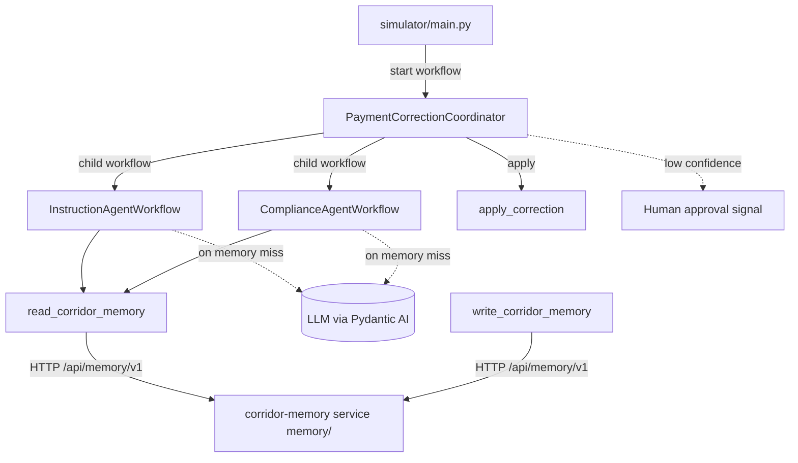

# Temporal Payment Corridor Workshop

Repairs cross-border payments that arrive with an anomaly — a wrong IBAN,
a missing intermediary bank, a currency mismatch — by coordinating
specialized AI agents as durable Temporal workflows, with a passive
corridor memory and human oversight for low-confidence fixes. It doubles
as a hands-on Temporal + Pydantic AI training that runs end-to-end on a
local dev server.

## Features

- **Durable agents** — Pydantic AI agents wrapped as Temporal workflows,
  so every model call survives worker crashes and restarts.
- **Coordinator + child workflows** — a parent workflow fans out to an
  instruction agent and a compliance agent, each its own child workflow.
- **Passive corridor memory** — agents check a memory of known
  corridor-specific patterns before spending a model call; the seeded
  happy path never touches an LLM.
- **Human-in-the-loop** — low-confidence corrections wait for a human
  decision via Signal, demonstrated as progressive steps.
- **One metrics endpoint** — a single Prometheus/OpenMetrics endpoint
  serves both Temporal SDK metrics (`temporal_*`) and application metrics
  (`corridor_*`).
- **Progressive activation** — the full application ships up front;
  workshop steps are enabled by uncommenting tagged `FEATURE-ON` blocks.

## Prerequisites

- **Python 3.12+** and [uv](https://docs.astral.sh/uv/)
- **Docker** (or a compatible engine) with Compose — runs the Temporal
  dev server container
- **LLM provider API key** — only needed once an anomaly misses corridor
  memory and an agent actually calls a model (e.g. `ANTHROPIC_API_KEY`)

No Kubernetes or cloud account is required.

## Getting Started

```bash
git clone <repository-url>
cd temporal-payment-corridor-workshop
uv sync
cp .env.example .env   # optional: adjust configuration
```

Contributors should enable the local pre-commit hook once. It runs ruff
formatting and lint before each commit, so a slip is caught locally
instead of only by CI:

```bash
make setup       # enable the local ruff pre-commit hook
```

Start the Temporal dev server, then the worker, the web UI, and the corridor
memory service (all with hot reload) in one go — three host processes plus
the Temporal container. The command prints the reachable URLs in a banner:

```bash
make dev       # Temporal dev server, then worker + web UI + memory on the host
```

The worker and the memory service run in two separate Temporal namespaces
(`payments` and `memory`); the dev server pre-creates both. The worker never
talks to the memory service over Temporal — it calls the memory HTTP API
(`/api/memory/v1`) instead.

Then, in another terminal, fire a payment anomaly:

```bash
make simulator   # simulate an incoming payment anomaly
```

`make dev` already serves the web UI (a temporal.io-styled landing page).
Use `make webui` to run only the web UI — for example when iterating on the
frontend against an already-running worker:

```bash
make webui       # http://localhost:8000
```

Likewise, `make memory` runs only the corridor memory service (its HTTP API
serves `/api/memory/v1` on http://localhost:8010):

```bash
make memory      # http://localhost:8010
```

By default the Temporal Web UI is at http://localhost:8233 — served through
the gateway, the app's single published HTTP entry point — and the worker
metrics at http://localhost:9464/metrics; `make dev` also prints these URLs
in its banner. The default anomaly matches a pre-seeded corridor-memory
pattern, so it is corrected end-to-end with no API key. Run `make help` to
list all targets (`infra-up`, `infra-down`, `payments`, `lint`, ...).

## Workshop features

The full application ships up front; individual capabilities stay dormant in
tagged `# region FEATURE-ON: <name>` blocks until you enable them. Toggle
them by name — no manual editing:

```bash
make feature-list                           # every feature and its state
make feature-diff    NAME=search-attributes # what enabling it changes
make feature-enable  NAME=search-attributes # turn it on (everywhere it appears)
make feature-disable NAME=search-attributes # revert
```

Enabling uncomments a feature's code; disabling re-comments it. A feature that
replaces existing behavior pairs a `# region FEATURE-ON: <name>` block with an
inverse `# region FEATURE-OFF: <name>` block, so the swap is reversible
both ways.

These blocks use VS Code folding-region markers. On open (with the
recommended `zokugun.explicit-folding` extension installed), VS Code folds
the dormant `# region FEATURE-ON:` regions while the base implementation
(the `# region FEATURE-OFF:` / live code) stays visible. Expand a folded
`FEATURE-ON` region to study it.

### Decrypting payloads in the Web UI (codec server)

Once `payload-encryption` is enabled (`make feature-enable
NAME=payload-encryption`) the worker encrypts every payload on the wire, so
the Temporal Web UI shows raw ciphertext in Event History. A codec server
decrypts payloads on demand — a small HTTP service that reuses the same
encryption key (`CODEC_ENCRYPTION_KEY`) — and the Web UI calls it to
display cleartext.

Both the codec server and the gateway are Compose services that come up with
the stack (`make dev` / `make infra-up` / `make app-up`). The gateway is the
app's single published HTTP entry point (`http://localhost:8233`): it serves
the Temporal Web UI at `/` and the codec server at `/codec`. Because the UI
page and the codec endpoint share this one origin, calls from the UI to
`/codec` are same-origin, so the browser sends no CORS preflight and the codec
server needs no CORS configuration.

The codec always starts, even before encryption is configured: when
`CODEC_ENCRYPTION_KEY` or `CODEC_SERVER_AUTH_TOKEN` is unset it falls back to a
public, insecure built-in default and logs a warning, so the demo works out of
the box (the `/codec` route returns 502 only during the brief startup window).

To decode encrypted payloads in Session 3:

1. Enable `payload-encryption` (`make feature-enable NAME=payload-encryption`).
2. `cp .env.example .env` — the shipped file already sets matching
   `CODEC_ENCRYPTION_KEY` and `CODEC_SERVER_AUTH_TOKEN` demo values (replace
   them with your own to secure the setup).
3. (Re)start the stack so the worker and codec pick up the configuration — for
   example `make dev` (or `make app-up`).

The dev server is already pointed at `/codec` via its
`--ui-codec-endpoint http://localhost:8233/codec` flag, and the gateway
injects the bearer token, so decrypted payloads appear in the Web UI with no
manual UI configuration. Thanks to the matching built-in defaults, decoding
even works before you create a `.env` at all.

### Authenticating the codec server

Left open, the codec server decrypts payloads for anyone who can reach it — an
unauthenticated decryption oracle. So it requires a shared bearer token on
every request and rejects any call whose `Authorization` header does not carry
that secret. When `CODEC_SERVER_AUTH_TOKEN` is unset the server does not fail;
it falls back to a public, insecure built-in default (logging a warning) so the
demo authenticates out of the box. Set your own token (`.env.example` ships one;
regenerate it with `python -c "import secrets;
print(secrets.token_urlsafe(32))"`) to actually secure the codec.

The Web UI cannot send that static secret itself: it only forwards a signed-in
user's access token, and a local `temporal server start-dev` has no signed-in
user. The gateway is the trusted local client that supplies it, injecting
`Authorization: Bearer $CODEC_SERVER_AUTH_TOKEN` on every request it forwards
to `/codec` (and defaulting to the same built-in token when the variable is
unset). This is a local-development convenience only: in production the Web UI
forwards the signed-in user's real access token, so no gateway or shared secret
is needed.

If you prefer the command line, point the CLI at the codec through the gateway.
No `--codec-auth` is needed — the gateway injects the token:

```bash
temporal workflow show --codec-endpoint http://localhost:8233/codec
```

### Registering Search Attributes (search-attributes)

Once `search-attributes` is enabled (`make feature-enable
NAME=search-attributes`) the coordinator tags each workflow execution with a
`corridor` and an `anomalyType` Search Attribute. Before you can filter or
list executions by them, register the two custom attributes on the dev
server:

```bash
temporal operator search-attribute create --name corridor --type Keyword
temporal operator search-attribute create --name anomalyType --type Keyword
```

Without this step the worker fails when it tries to upsert unregistered
attributes. After registering, filter executions in the Web UI or with
`temporal workflow list --query "corridor = '...'"`.

Enabling a feature that changes workflow code — as `search-attributes` does
by adding a Search Attribute upsert inside the coordinator — intentionally
invalidates the committed replay fixture
(`payments/testdata/coordinator-history.json`). The captured history no longer
matches the new code path, so `payments/test_replay.py` failing after you
enable such a feature is expected, not a regression. Regenerate the fixture
for the new state with `make capture-history` if you want a passing replay
test while the feature stays enabled. That capture drives the coordinator,
which now reads corridor memory over HTTP, so `make memory` must be running
first.

## Usage

`make simulator` starts a `PaymentCorrectionCoordinator` execution and prints
the outcome:

```text
applied : True
message : Correction applied (reference corr-iban-12358).
proposal: iban=DE89370400440532013000 (confidence 0.95, via memory / instruction_agent)
```

Inspect the merged metrics endpoint:

```bash
curl -s http://localhost:9464/metrics | grep -E '^(temporal_|corridor_)'
```

## Configuration

All configuration comes from environment variables, loaded from a local
`.env` file when present (see [.env.example](.env.example)).

| Variable               | Description                              | Default                       |
| ---------------------- | ---------------------------------------- | ----------------------------- |
| `TEMPORAL_ADDRESS`     | Temporal frontend address                | `localhost:7233`              |
| `WORKER_METRICS_HOST`  | Host for the `/metrics` endpoint         | `0.0.0.0`                     |
| `WORKER_METRICS_PORT`  | Port for the `/metrics` endpoint         | `9464`                        |
| `CORRIDOR_MODEL`       | Pydantic AI model string for the agents  | `anthropic:claude-sonnet-5`   |
| `ANTHROPIC_API_KEY`    | Provider key matching `CORRIDOR_MODEL`   | (required to run the agents)  |

## Architecture

The payment-correction worker (`payments/`, namespace `payments`) hosts the
coordinator, agents, and activities on one task queue. The coordinator
orchestrates the agents; agents consult corridor memory before the LLM;
activities perform all side effects and emit application metrics. Corridor
memory is a separate service (`memory/`) that the `read_corridor_memory` and
`write_corridor_memory` activities reach over HTTP (`/api/memory/v1`). With
the `memory-workflow` FEATURE on, that service runs its own embedded worker
and `MemoryWorkflow` on namespace `memory`; otherwise it serves a naive
in-memory store.



| Module                   | Description                                                                                                                          |
| ------------------------ | ------------------------------------------------------------------------------------------------------------------------------------ |
| `shared/models.py`       | Shared Pydantic models exchanged across the Temporal boundary                                                                        |
| `payments/agents.py`     | Pydantic AI agents wrapped as durable `TemporalAgent`s                                                                               |
| `payments/workflows.py`  | Coordinator and agent child workflows                                                                                                |
| `payments/activities.py` | Applying the correction                                                                                                              |
| `payments/memory.py`     | HTTP-client activities (`read_corridor_memory` / `write_corridor_memory`) calling the corridor-memory service over `/api/memory/v1`. |
| `payments/worker.py`     | Builds the `Worker`: task queue + workflow/activity registration                                                                     |
| `payments/main.py`       | Worker entrypoint: runtime, metrics, Logfire, hot reload                                                                             |
| `webui/app.py`           | FastAPI web UI: routes, Logfire, temporal.io-styled landing page                                                                     |
| `webui/main.py`          | Web UI entrypoint: uvicorn with hot reload                                                                                           |
| `memory/app.py`          | FastAPI corridor-memory service: the `/api/memory/v1` routes                                                                         |
| `memory/store.py`        | Naive in-memory corridor-pattern store (baseline backend)                                                                            |
| `memory/workflow.py`     | `MemoryWorkflow` durable store for the `memory-workflow` FEATURE                                                                     |
| `memory/main.py`         | Memory service entrypoint: uvicorn with hot reload                                                                                   |
| `codec/app.py`           | FastAPI codec server: decrypts payloads for the Temporal Web UI                                                                      |
| `codec/main.py`          | Codec server entrypoint: uvicorn without reload                                                                                      |
| `Dockerfile.codec`       | Codec server image                                                                                                                   |
| `gateway/Caddyfile`      | API gateway: single entry point, injects the codec bearer token                                                                      |
| `simulator/main.py`      | Client that simulates an incoming payment anomaly                                                                                    |

## License

This project is licensed under the Apache-2.0 License — see
[LICENSE](LICENSE) for details.
