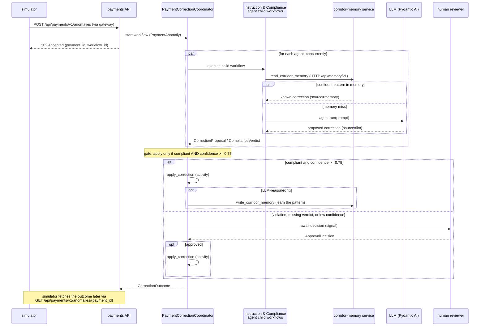

# Temporal Payment Corridor Workshop

[](https://github.com/alexandreroman/temporal-payment-corridor-workshop/actions/workflows/ci.yml)
[](LICENSE)

Repairs cross-border payments that arrive with an anomaly — a wrong
BIC/SWIFT code, a missing intermediary bank, a currency mismatch — by
coordinating specialized AI agents as durable Temporal workflows, with
a passive corridor memory and human oversight for low-confidence fixes.
It doubles as a hands-on Temporal + Pydantic AI training that runs
end-to-end on a local dev server.

> [!TIP]
> **New here? Start with the [learner guide](guide/README.md).** It walks
> you from the running baseline to a production-shaped system, one Temporal
> concept at a time. This README is the reference documentation.

> [!NOTE]
> The payment/transfer domain model is intentionally simplified to keep
> the workshop focused on durable execution with Temporal, not on
> payments compliance. A real cross-border payment carries far more than
> a single field. Here each anomaly targets exactly one field — a wrong
> BIC, a missing intermediary bank, or a currency mismatch — so the
> correction logic stays easy to follow.

## Features

- **Durable agents** — Pydantic AI agents wrapped as Temporal workflows,
  so every model call survives worker crashes and restarts.
- **Coordinator + child workflows** — a parent workflow fans out to two
  specialized agents, each running as its own child workflow: an
  **instruction agent** that proposes a fix, and a **compliance agent**
  that returns a verdict on it. The coordinator applies the fix only when
  compliance clears it and confidence is high enough; otherwise it holds
  for human review.
- **Passive corridor memory** — agents check a memory of known correction
  patterns before spending a model call, so the seeded happy path never
  touches an LLM and runs with no API key.
- **Human-in-the-loop** — low-confidence corrections wait for a human
  decision via Signal, demonstrated as progressive steps.
- **One metrics endpoint** — a single Prometheus/OpenMetrics endpoint
  serves both Temporal SDK metrics (`temporal_*`) and application metrics
  (`corridor_*`).
- **HTTP API** — external clients and the simulator submit anomalies and
  observe in-flight corrections through a single HTTP API
  (`/api/payments/v1`) behind the gateway, never by opening a Temporal
  client of their own.
- **Progressive activation** — the full application ships up front;
  workshop steps are enabled by uncommenting tagged `FEATURE-ON` blocks.

## Prerequisites

- **Python 3.13+** and [uv](https://docs.astral.sh/uv/)
- **Docker** (or a compatible engine) with Compose — runs the Temporal
  dev server container
- **LLM provider API key** — only needed once an anomaly misses corridor
  memory and an agent actually calls a model (e.g. `ANTHROPIC_API_KEY`)
- **[Temporal CLI](https://docs.temporal.io/cli)** (`temporal`) — used by
  the learner guide's observation commands (`temporal workflow …`) and by
  the optional replay-fixture capture (`make capture-history`); not needed
  for the core `make dev` flow
- **[jq](https://jqlang.github.io/jq/)** — used to shape `curl` output
  throughout the guide and by the optional replay-fixture capture, where
  `make capture-history` uses it to shape the captured history JSON

No Kubernetes or cloud account is required.

## Getting Started

```bash
git clone <repository-url>
cd temporal-payment-corridor-workshop
uv sync
cp .env.example .env   # optional: adjust configuration
```

There are two ways to run the app. For development, `make dev` brings up
the stack — the Temporal dev server, the payments worker and its HTTP API,
and the corridor memory service — with hot reload, and prints the reachable
URLs in a banner:

```bash
make dev       # Temporal dev server + gateway + payments worker & API & memory
```

For a fully containerized run, `make app-up` brings the whole stack up in
containers (`make app-down` tears it down):

```bash
make app-up    # bring up the full stack in containers
```

Payments and the corridor memory service run in two separate Temporal
namespaces (`payments` and `memory`), both pre-created by the dev server.

Then, in another terminal, fire a payment anomaly:

```bash
make simulator   # simulate an incoming payment anomaly
```

By default the Web UI (the homepage) is at http://localhost:8080 and the
Temporal Web UI at http://localhost:8080/temporal; `make dev` prints both
URLs in its banner. With `make dev`, payments metrics are also scrapable on
localhost at http://localhost:9464/metrics. The homepage lists corrections and
auto-refreshes; once `human-approval-signal` is enabled it also lets you
approve or reject corrections held for human review. The default anomaly
matches a pre-seeded corridor-memory pattern, so it is corrected end-to-end
with no API key. Run `make help` to list all targets.

## Workshop features

The full application ships up front; individual capabilities stay dormant in
tagged `# region FEATURE-ON: <name>` blocks until you enable them. Toggle
them by name — no manual editing:

```bash
make feature-list                           # every feature and its state
make feature-diff    NAME=search-attributes # what enabling it changes
make feature-enable  NAME=search-attributes # turn it on (everywhere it appears)
make feature-disable NAME=search-attributes # revert
```

Enabling uncomments a feature's code; disabling re-comments it. A feature that
replaces existing behavior pairs a `# region FEATURE-ON: <name>` block with an
inverse `# region FEATURE-OFF: <name>` block, so the swap is reversible
both ways.

These blocks use VS Code folding-region markers. On open (with the
recommended `zokugun.explicit-folding` extension installed), VS Code folds
the dormant `# region FEATURE-ON:` regions while the base implementation
(the `# region FEATURE-OFF:` / live code) stays visible. Expand a folded
`FEATURE-ON` region to study it.

### Decrypting payloads in the Temporal Web UI (codec server)

Once `payload-encryption` is enabled (`make feature-enable
NAME=payload-encryption`) payments encrypts every payload on the wire, so
the Temporal Web UI shows raw ciphertext in Event History. A **codec
server** — a small HTTP service that reuses the same encryption key —
decrypts payloads on demand, and the Temporal Web UI calls it to display
cleartext.

You don't have to configure anything for the demo. When
`CODEC_ENCRYPTION_KEY` and `CODEC_SERVER_AUTH_TOKEN` are unset, the codec
falls back to public, insecure built-in defaults (logging a warning), so
decoding works out of the box — decrypted payloads appear in the Temporal
Web UI with no manual configuration. Set your own values in `.env` only
when you want to actually secure the setup.

The same goes for the CLI: with the feature active, point `temporal` at the
codec to read decrypted payloads:

```bash
temporal workflow show \
  --workflow-id <workflow-id> \
  --codec-endpoint http://localhost:8080/codec
```

### Registering Search Attributes (search-attributes)

Once `search-attributes` is enabled (`make feature-enable
NAME=search-attributes`) the coordinator tags each workflow execution with a
`corridor`, an `anomalyType`, and a `status` Search Attribute — the last
carrying the correction lifecycle (`processing` → `awaiting-approval`) so
operators can filter corrections fleet-wide from the CLI and the Temporal
Web UI. All three custom
attributes are pre-registered by the dev server on startup (`make dev` /
`make app-up`), so there is no manual registration step — filter executions
in the Temporal Web UI or with
`temporal workflow list --query "corridor = '...'"`.

Enabling a feature that changes workflow code — as `search-attributes` does
by adding a Search Attribute upsert inside the coordinator — intentionally
invalidates the committed replay fixture
(`payments/testdata/coordinator-history.json`). The captured history no longer
matches the new code path, so `payments/test_replay.py` failing after you
enable such a feature is expected, not a regression. To get a passing
replay test while the feature stays enabled, regenerate the fixture from a
completed run. `make capture-history` is no longer self-contained: it
captures an existing execution, so it assumes `make dev` is up and a `make
simulator` run has happened — pass that run's workflow id, e.g. `make
capture-history WORKFLOW_ID=correction-pmt-XXXX`.

## Usage

`make simulator` submits an anomaly to the payments API through the gateway,
which starts a `PaymentCorrectionCoordinator` execution, and prints the
accepted identifiers:

```text
scenario: memory-hit
payment : pmt-9f3c1a2b
workflow: correction-pmt-9f3c1a2b
accepted: submitted to http://localhost:8080/api/payments/v1/anomalies
```

Follow the correction on the homepage (http://localhost:8080) or in the
Temporal Web UI at http://localhost:8080/temporal.

By default this sends the offline `memory-hit` scenario. Pick another named
scenario with `SCENARIO=<name>`:

```bash
make simulator SCENARIO=memory-miss
```

Run `make simulator-list` to see them all. Every scenario other than
`memory-hit` misses corridor memory and invokes the agents, so it needs
`ANTHROPIC_API_KEY` (see [Configuration](#configuration)). Always launch the
simulator through `make` so it targets the right ports.

Inspect the merged metrics endpoint:

```bash
curl -s http://localhost:9464/metrics | grep -E '^(temporal_|corridor_)'
```

## Configuration

All configuration comes from environment variables, loaded from a local
`.env` file when present (see [.env.example](.env.example)). The essentials
are the AI model the agents use and its matching provider key:

| Variable            | Description                             | Default                      |
| ------------------- | --------------------------------------- | ---------------------------- |
| `CORRIDOR_MODEL`    | Pydantic AI model string for the agents | `anthropic:claude-sonnet-5`  |
| `ANTHROPIC_API_KEY` | Provider key matching `CORRIDOR_MODEL`  | (required to run the agents) |

Swap `CORRIDOR_MODEL` and its provider key for any other Pydantic AI provider.
See [.env.example](.env.example) for the remaining, rarely changed settings.

## Architecture

The payment-correction component (`payments/`, namespace `payments`) runs as
two processes that share one package: the payments worker hosts the
coordinator, agents, and activities on one task queue, while the payments HTTP
API (`/api/payments/v1`) is a Temporal client that starts and observes
corrections for external callers. The coordinator
orchestrates two specialized agents — the instruction agent proposes a fix
to the payment instruction so it can settle, while the compliance agent
returns a verdict guarding the fix against currency and sanctions rules — and
applies the fix only when the verdict clears it and confidence ≥ 0.75
(fail-closed otherwise). Each agent consults corridor memory before the LLM;
activities perform all side effects and emit application metrics. After an
LLM-reasoned correction is applied, the coordinator writes the learned
pattern back via `write_corridor_memory` so the next matching anomaly can
skip the model. Corridor
memory is a separate service (`memory/`) that the `read_corridor_memory` and
`write_corridor_memory` activities reach over HTTP (`/api/memory/v1`). With
the `memory-workflow` FEATURE on, that service runs its own embedded worker
and `MemoryWorkflow` on namespace `memory`; otherwise it serves a naive
in-memory store.

The correction of one payment plays out as this sequence — the coordinator
fans out to both agents concurrently, each tries corridor memory before the
LLM, and the coordinator applies the fix or escalates to a human:



| Component     | Role                                                                                                                     |
| ------------- | ------------------------------------------------------------------------------------------------------------------------ |
| `shared/`     | Pydantic models exchanged across the Temporal boundary                                                                   |
| `payments/`   | Payment-correction component (namespace `payments`): a Temporal worker plus the `/api/payments/v1` HTTP API              |
| `memory/`     | Corridor-memory service (namespace `memory`): serves `/api/memory/v1` over an in-memory store or `MemoryWorkflow`        |
| `webui/`      | Static Web UI (temporal.io-styled landing page), served by the gateway                                                   |
| `codec/`      | Codec server that decrypts payloads for the Temporal Web UI (with `payload-encryption`)                                  |
| `gateway/`    | API gateway — the single published HTTP entry point                                                                      |
| `simulator/`  | Client that simulates an incoming payment anomaly                                                                        |

## License

This project is licensed under the Apache-2.0 License — see
[LICENSE](LICENSE) for details.
