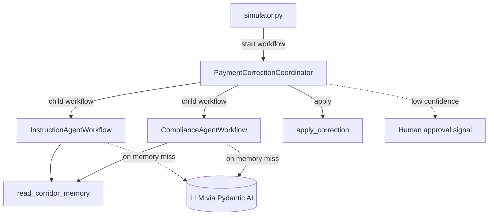

# temporal-payment-corridor-workshop

Repairs cross-border payments that arrive with an anomaly — a wrong IBAN,
a missing intermediary bank, a currency mismatch — by coordinating
specialized AI agents as durable Temporal workflows, with a passive
corridor memory and human oversight for low-confidence fixes. It doubles
as a hands-on Temporal + Pydantic AI training that runs end-to-end on a
local dev server.

## Features

- **Durable agents** — Pydantic AI agents wrapped as Temporal workflows,
  so every model call survives worker crashes and restarts.
- **Coordinator + child workflows** — a parent workflow fans out to an
  instruction agent and a compliance agent, each its own child workflow.
- **Passive corridor memory** — agents check a memory of known
  corridor-specific patterns before spending a model call; the seeded
  happy path never touches an LLM.
- **Human-in-the-loop** — low-confidence corrections wait for a human
  decision via Signal (or Update), demonstrated as progressive steps.
- **One metrics endpoint** — a single Prometheus/OpenMetrics endpoint
  serves both Temporal SDK metrics (`temporal_*`) and application metrics
  (`corridor_*`).
- **Progressive activation** — the full application ships up front;
  workshop steps are enabled by uncommenting tagged `STEP` blocks.

## Prerequisites

- **Python 3.12+** and [uv](https://docs.astral.sh/uv/)
- **Docker** (or a compatible engine) with Compose — runs the Temporal
  dev server container
- **LLM provider API key** — only needed once an anomaly misses corridor
  memory and an agent actually calls a model (e.g. `ANTHROPIC_API_KEY`)

No Kubernetes or cloud account is required.

## Getting Started

```bash
git clone <repository-url>
cd temporal-payment-corridor-workshop
uv sync
cp .env.example .env   # optional: adjust configuration
```

Start the Temporal dev server and the worker (with hot reload) in one go:

```bash
make dev       # docker compose up temporal, then run the worker on the host
```

Then, in another terminal, fire a payment anomaly:

```bash
make simulator   # simulate an incoming payment anomaly
```

The Temporal Web UI is at http://localhost:8233 and the worker metrics at
http://localhost:9464/metrics. The default anomaly matches a pre-seeded
corridor-memory pattern, so it is corrected end-to-end with no API key.
Run `make help` to list all targets (`infra-up`, `infra-down`, `worker`,
`lint`, ...).

## Usage

`make simulator` starts a `PaymentCorrectionCoordinator` execution and prints
the outcome:

```text
applied : True
message : Correction applied (reference corr-iban-12358).
proposal: iban=DE89370400440532013000 (confidence 0.95, via memory / instruction_agent)
```

Inspect the merged metrics endpoint:

```bash
curl -s http://localhost:9464/metrics | grep -E '^(temporal_|corridor_)'
```

## Configuration

All configuration comes from environment variables, loaded from a local
`.env` file when present (see [.env.example](.env.example)).

| Variable               | Description                              | Default                       |
| ---------------------- | ---------------------------------------- | ----------------------------- |
| `TEMPORAL_ADDRESS`     | Temporal frontend address                | `localhost:7233`              |
| `METRICS_BIND_ADDRESS` | Bind address for the `/metrics` endpoint | `0.0.0.0:9464`                |
| `CORRIDOR_MODEL`       | Pydantic AI model string for the agents  | `anthropic:claude-sonnet-4-5` |
| `ANTHROPIC_API_KEY`    | Provider key matching `CORRIDOR_MODEL`   | (required to run the agents)  |
| `LOGFIRE_TOKEN`        | Ships traces to Logfire when set         | (optional)                    |

## Architecture

A single worker process hosts every workflow and activity on one task
queue. The coordinator orchestrates the agents; agents consult corridor
memory before the LLM; activities perform all side effects and emit
application metrics.



| Module          | Description                                                    |
| --------------- | ------------------------------------------------------------- |
| `models.py`     | Shared Pydantic models exchanged across the Temporal boundary |
| `agents.py`     | Pydantic AI agents wrapped as durable `TemporalAgent`s        |
| `workflows.py`  | Coordinator, agent child workflows, and corridor memory       |
| `activities.py` | Corridor-memory read/write and applying the correction        |
| `worker.py`     | Worker entrypoint: runtime, metrics, Logfire, registration    |
| `simulator.py`  | Client that simulates an incoming payment anomaly             |

## License

This project is licensed under the Apache-2.0 License — see
[LICENSE](LICENSE) for details.
