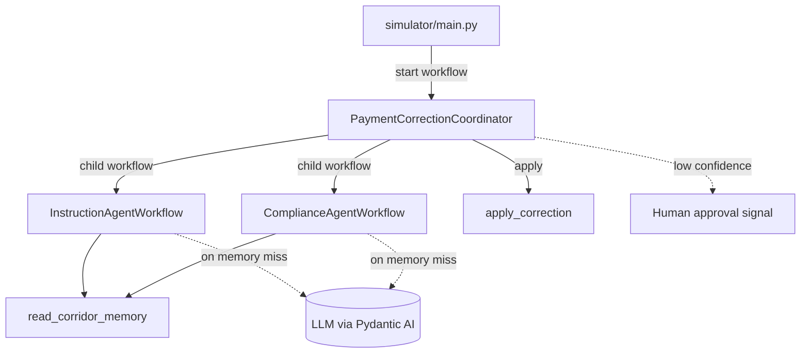

# Temporal Payment Corridor Workshop

Repairs cross-border payments that arrive with an anomaly — a wrong IBAN,
a missing intermediary bank, a currency mismatch — by coordinating
specialized AI agents as durable Temporal workflows, with a passive
corridor memory and human oversight for low-confidence fixes. It doubles
as a hands-on Temporal + Pydantic AI training that runs end-to-end on a
local dev server.

## Features

- **Durable agents** — Pydantic AI agents wrapped as Temporal workflows,
  so every model call survives worker crashes and restarts.
- **Coordinator + child workflows** — a parent workflow fans out to an
  instruction agent and a compliance agent, each its own child workflow.
- **Passive corridor memory** — agents check a memory of known
  corridor-specific patterns before spending a model call; the seeded
  happy path never touches an LLM.
- **Human-in-the-loop** — low-confidence corrections wait for a human
  decision via Signal (or Update), demonstrated as progressive steps.
- **One metrics endpoint** — a single Prometheus/OpenMetrics endpoint
  serves both Temporal SDK metrics (`temporal_*`) and application metrics
  (`corridor_*`).
- **Progressive activation** — the full application ships up front;
  workshop steps are enabled by uncommenting tagged `FEATURE` blocks.

## Prerequisites

- **Python 3.12+** and [uv](https://docs.astral.sh/uv/)
- **Docker** (or a compatible engine) with Compose — runs the Temporal
  dev server container
- **LLM provider API key** — only needed once an anomaly misses corridor
  memory and an agent actually calls a model (e.g. `ANTHROPIC_API_KEY`)

No Kubernetes or cloud account is required.

## Getting Started

```bash
git clone <repository-url>
cd temporal-payment-corridor-workshop
uv sync
cp .env.example .env   # optional: adjust configuration
```

Contributors should enable the local pre-commit hook once. It runs ruff
formatting and lint before each commit, so a slip is caught locally
instead of only by CI:

```bash
make setup       # enable the local ruff pre-commit hook
```

Start the Temporal dev server, then the worker and the web UI (all with hot
reload) in one go. The command prints the reachable URLs in a banner:

```bash
make dev       # Temporal dev server, then worker + web UI on the host
```

Then, in another terminal, fire a payment anomaly:

```bash
make simulator   # simulate an incoming payment anomaly
```

`make dev` already serves the web UI (a temporal.io-styled landing page).
Use `make webui` to run only the web UI — for example when iterating on the
frontend against an already-running worker:

```bash
make webui       # http://localhost:8000
```

By default the Temporal Web UI is at http://localhost:8233 and the worker
metrics at http://localhost:9464/metrics; `make dev` also prints these URLs
in its banner. The default anomaly matches a pre-seeded corridor-memory
pattern, so it is corrected end-to-end with no API key. Run `make help` to
list all targets (`infra-up`, `infra-down`, `worker`, `lint`, ...).

## Workshop features

The full application ships up front; individual capabilities stay dormant in
tagged `# --- FEATURE: <name> ---` blocks until you enable them. Toggle them by
name — no manual editing:

```bash
make feature-list                           # every feature and its state
make feature-diff    NAME=search-attributes # what enabling it changes
make feature-enable  NAME=search-attributes # turn it on (everywhere it appears)
make feature-disable NAME=search-attributes # revert
```

Enabling uncomments a feature's code; disabling re-comments it. A feature that
replaces existing behavior pairs a `FEATURE` block with an inverse
`FEATURE-DEFAULT` block, so the swap is reversible both ways.

### Decrypting payloads in the Web UI (codec server)

Once `payload-encryption` is enabled (`make feature-enable
NAME=payload-encryption`) the worker encrypts every payload on the wire, so
the Temporal Web UI shows raw ciphertext in Event History. Start the codec
server to fix that:

```bash
make codec-server   # http://localhost:8081
```

It is a small HTTP service that reuses the same encryption key
(`CORRIDOR_ENCRYPTION_KEY`, so set it first) to decrypt payloads on demand.
Point the Web UI at it from the Web UI's own settings (the "Codec Server"
endpoint field, `http://localhost:8081`). The dev server in `compose.yaml`
runs `temporal server start-dev` without a codec endpoint; to wire it in at
startup instead, add `--ui-codec-endpoint http://localhost:8081` to that
command. The Web UI then displays decrypted payloads instead of ciphertext.

### Registering Search Attributes (search-attributes)

Once `search-attributes` is enabled (`make feature-enable
NAME=search-attributes`) the coordinator tags each workflow execution with a
`corridor` and an `anomalyType` Search Attribute. Before you can filter or
list executions by them, register the two custom attributes on the dev
server:

```bash
temporal operator search-attribute create --name corridor --type Keyword
temporal operator search-attribute create --name anomalyType --type Keyword
```

Without this step the worker fails when it tries to upsert unregistered
attributes. After registering, filter executions in the Web UI or with
`temporal workflow list --query "corridor = '...'"`.

Enabling a feature that changes workflow code — as `search-attributes` does
by adding a Search Attribute upsert inside the coordinator — intentionally
invalidates the committed replay fixture
(`worker/testdata/coordinator-history.json`). The captured history no longer
matches the new code path, so `worker/test_replay.py` failing after you
enable such a feature is expected, not a regression. Regenerate the fixture
for the new state with `make capture-history` if you want a passing replay
test while the feature stays enabled.

## Usage

`make simulator` starts a `PaymentCorrectionCoordinator` execution and prints
the outcome:

```text
applied : True
message : Correction applied (reference corr-iban-12358).
proposal: iban=DE89370400440532013000 (confidence 0.95, via memory / instruction_agent)
```

Inspect the merged metrics endpoint:

```bash
curl -s http://localhost:9464/metrics | grep -E '^(temporal_|corridor_)'
```

## Configuration

All configuration comes from environment variables, loaded from a local
`.env` file when present (see [.env.example](.env.example)).

| Variable               | Description                              | Default                       |
| ---------------------- | ---------------------------------------- | ----------------------------- |
| `TEMPORAL_ADDRESS`     | Temporal frontend address                | `localhost:7233`              |
| `WORKER_METRICS_HOST`  | Host for the `/metrics` endpoint         | `0.0.0.0`                     |
| `WORKER_METRICS_PORT`  | Port for the `/metrics` endpoint         | `9464`                        |
| `CORRIDOR_MODEL`       | Pydantic AI model string for the agents  | `anthropic:claude-sonnet-5`   |
| `ANTHROPIC_API_KEY`    | Provider key matching `CORRIDOR_MODEL`   | (required to run the agents)  |

## Architecture

A single worker process hosts every workflow and activity on one task
queue. The coordinator orchestrates the agents; agents consult corridor
memory before the LLM; activities perform all side effects and emit
application metrics.



| Module                 | Description                                                          |
| ---------------------- | -------------------------------------------------------------------- |
| `shared/models.py`     | Shared Pydantic models exchanged across the Temporal boundary        |
| `worker/agents.py`     | Pydantic AI agents wrapped as durable `TemporalAgent`s               |
| `worker/workflows.py`  | Coordinator and agent child workflows                                |
| `worker/activities.py` | Applying the correction                                              |
| `worker/memory.py`     | Passive corridor memory: store, read/write activities, and workflow  |
| `worker/worker.py`     | Builds the `Worker`: task queue + workflow/activity registration     |
| `worker/main.py`       | Worker entrypoint: runtime, metrics, Logfire, hot reload             |
| `webui/app.py`         | FastAPI web UI: routes, Logfire, temporal.io-styled landing page     |
| `webui/main.py`        | Web UI entrypoint: uvicorn with hot reload                           |
| `codec_server/app.py`  | FastAPI codec server: decrypts payloads for the Temporal Web UI      |
| `codec_server/main.py` | Codec server entrypoint: uvicorn without reload                      |
| `simulator/main.py`    | Client that simulates an incoming payment anomaly                    |

## License

This project is licensed under the Apache-2.0 License — see
[LICENSE](LICENSE) for details.
