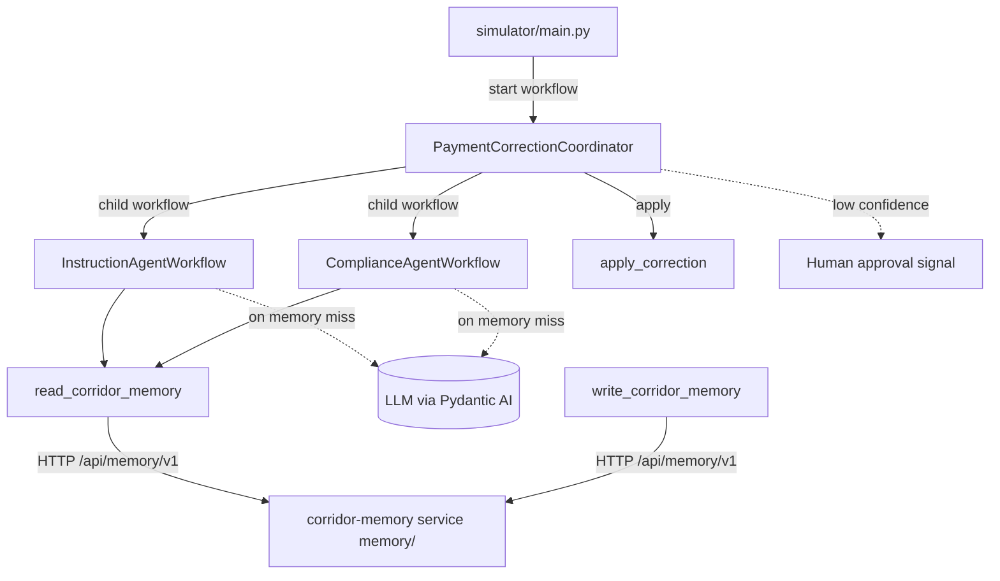

# Temporal Payment Corridor Workshop

[](https://github.com/alexandreroman/temporal-payment-corridor-workshop/actions/workflows/ci.yml)
[](LICENSE)

Repairs cross-border payments that arrive with an anomaly — a wrong
BIC/SWIFT code, a missing intermediary bank, a currency mismatch — by
coordinating specialized AI agents as durable Temporal workflows, with
a passive corridor memory and human oversight for low-confidence fixes.
It doubles as a hands-on Temporal + Pydantic AI training that runs
end-to-end on a local dev server.

> [!NOTE]
> The payment/transfer domain model is intentionally simplified to keep
> the workshop focused on durable execution with Temporal, not on
> payments compliance. A real cross-border payment carries far more than
> a single field. Here each anomaly targets exactly one field — a wrong
> BIC, a missing intermediary bank, or a currency mismatch — so the
> correction logic stays easy to follow.

## Features

- **Durable agents** — Pydantic AI agents wrapped as Temporal workflows,
  so every model call survives worker crashes and restarts.
- **Coordinator + child workflows** — a parent workflow fans out to an
  instruction agent and a compliance agent, each its own child workflow.
- **Passive corridor memory** — agents check a memory of known
  corridor-specific patterns before spending a model call; the seeded
  happy path never touches an LLM.
- **Human-in-the-loop** — low-confidence corrections wait for a human
  decision via Signal, demonstrated as progressive steps.
- **One metrics endpoint** — a single Prometheus/OpenMetrics endpoint
  serves both Temporal SDK metrics (`temporal_*`) and application metrics
  (`corridor_*`).
- **Progressive activation** — the full application ships up front;
  workshop steps are enabled by uncommenting tagged `FEATURE-ON` blocks.

## Prerequisites

- **Python 3.13+** and [uv](https://docs.astral.sh/uv/)
- **Docker** (or a compatible engine) with Compose — runs the Temporal
  dev server container
- **LLM provider API key** — only needed once an anomaly misses corridor
  memory and an agent actually calls a model (e.g. `ANTHROPIC_API_KEY`)

No Kubernetes or cloud account is required.

## Getting Started

```bash
git clone <repository-url>
cd temporal-payment-corridor-workshop
uv sync
cp .env.example .env   # optional: adjust configuration
```

Contributors should enable the local pre-commit hook once. It runs ruff
formatting and lint before each commit, so a slip is caught locally
instead of only by CI:

```bash
make setup       # enable the local ruff pre-commit hook
```

There are two ways to run the app. For development, `make dev` starts the
Temporal dev server plus payments, the web UI, and the corridor memory
service (all on the host with hot reload) and prints the reachable URLs in a
banner:

```bash
make dev       # Temporal dev server + payments, web UI & memory (hot reload)
```

For a fully containerized run, `make app-up` brings the whole stack up in
containers (`make app-down` tears it down):

```bash
make app-up    # bring up the full stack in containers
```

Payments and the memory service run in two separate Temporal namespaces
(`payments` and `memory`); the dev server pre-creates both. Payments never
talks to the memory service over Temporal — it calls the memory HTTP API
(`/api/memory/v1`) instead.

Then, in another terminal, fire a payment anomaly:

```bash
make simulator   # simulate an incoming payment anomaly
```

By default the Temporal Web UI is at http://localhost:8233 — served through
the gateway, the app's single published HTTP entry point — and the payments
metrics at http://localhost:9464/metrics; `make dev` also prints these URLs
in its banner. The default anomaly matches a pre-seeded corridor-memory
pattern, so it is corrected end-to-end with no API key. Run `make help` to
list all targets.

## Workshop features

The full application ships up front; individual capabilities stay dormant in
tagged `# region FEATURE-ON: <name>` blocks until you enable them. Toggle
them by name — no manual editing:

```bash
make feature-list                           # every feature and its state
make feature-diff    NAME=search-attributes # what enabling it changes
make feature-enable  NAME=search-attributes # turn it on (everywhere it appears)
make feature-disable NAME=search-attributes # revert
```

Enabling uncomments a feature's code; disabling re-comments it. A feature that
replaces existing behavior pairs a `# region FEATURE-ON: <name>` block with an
inverse `# region FEATURE-OFF: <name>` block, so the swap is reversible
both ways.

These blocks use VS Code folding-region markers. On open (with the
recommended `zokugun.explicit-folding` extension installed), VS Code folds
the dormant `# region FEATURE-ON:` regions while the base implementation
(the `# region FEATURE-OFF:` / live code) stays visible. Expand a folded
`FEATURE-ON` region to study it.

### Decrypting payloads in the Web UI (codec server)

Once `payload-encryption` is enabled (`make feature-enable
NAME=payload-encryption`) payments encrypts every payload on the wire, so
the Temporal Web UI shows raw ciphertext in Event History. A codec server
decrypts payloads on demand — a small HTTP service that reuses the same
encryption key — and the Web UI calls it to display cleartext.

Both the codec server and the gateway are Compose services that come up with
the stack (`make dev` / `make app-up`). The gateway is the app's single
published HTTP entry point (`http://localhost:8233`): it serves the Temporal
Web UI at `/` and the codec server at `/codec`, so calls from the UI to
`/codec` are same-origin and need no CORS configuration.

You don't have to configure anything for the demo. When `CODEC_ENCRYPTION_KEY`
and `CODEC_SERVER_AUTH_TOKEN` are unset, both the codec and the gateway fall
back to matching public, insecure built-in defaults (logging a warning) — so
decoding works out of the box, even before you create a `.env`. The dev server
is already pointed at `/codec` via its `--ui-codec-endpoint
http://localhost:8233/codec` flag, and the gateway injects the bearer token, so
decrypted payloads appear in the Web UI with no manual configuration. Set your
own `CODEC_ENCRYPTION_KEY` and `CODEC_SERVER_AUTH_TOKEN` in `.env` only when you
want to actually secure the setup.

The same goes for the CLI: with the feature active, point `temporal` at the
codec through the gateway to read decrypted payloads. No `--codec-auth` is
needed — the gateway injects the token:

```bash
temporal workflow show \
  --workflow-id <workflow-id> \
  --codec-endpoint http://localhost:8233/codec
```

### Registering Search Attributes (search-attributes)

Once `search-attributes` is enabled (`make feature-enable
NAME=search-attributes`) the coordinator tags each workflow execution with a
`corridor` and an `anomalyType` Search Attribute. Both custom attributes are
pre-registered by the dev server on startup (`make dev` / `make app-up`), so
there is no manual registration step — filter executions in the Web UI or with
`temporal workflow list --query "corridor = '...'"`.

Enabling a feature that changes workflow code — as `search-attributes` does
by adding a Search Attribute upsert inside the coordinator — intentionally
invalidates the committed replay fixture
(`payments/testdata/coordinator-history.json`). The captured history no longer
matches the new code path, so `payments/test_replay.py` failing after you
enable such a feature is expected, not a regression. Regenerate the fixture
for the new state with `make capture-history` if you want a passing replay
test while the feature stays enabled. That capture drives the coordinator,
which now reads corridor memory over HTTP, so the memory service must be
running first (e.g. via `make dev`).

## Usage

`make simulator` starts a `PaymentCorrectionCoordinator` execution and prints
the outcome:

```text
applied : True
message : Correction applied (reference corr-bic-12358).
proposal: bic=HDFCINBBXXX (confidence 0.95, via memory / instruction_agent)
```

By default this sends the offline `memory-hit` scenario. Pick another named
scenario with `SCENARIO=<name>`:

```bash
make simulator SCENARIO=memory-miss
```

Run `make simulator-list` to see them all. Every scenario other than
`memory-hit` misses corridor memory and invokes the agents, so it needs
`ANTHROPIC_API_KEY` (see [Configuration](#configuration)). Always launch the
simulator through `make`: the target exports the ports from
`compose.override.yaml`, so it keeps working when the ports are remapped.

Inspect the merged metrics endpoint:

```bash
curl -s http://localhost:9464/metrics | grep -E '^(temporal_|corridor_)'
```

## Configuration

All configuration comes from environment variables, loaded from a local
`.env` file when present (see [.env.example](.env.example)). The essentials
are the AI model the agents use and its matching provider key:

| Variable            | Description                             | Default                      |
| ------------------- | --------------------------------------- | ---------------------------- |
| `CORRIDOR_MODEL`    | Pydantic AI model string for the agents | `anthropic:claude-sonnet-5`  |
| `ANTHROPIC_API_KEY` | Provider key matching `CORRIDOR_MODEL`  | (required to run the agents) |

Swap `CORRIDOR_MODEL` and its provider key for any other Pydantic AI provider.
See [.env.example](.env.example) for the remaining, rarely changed settings.

## Architecture

The payment-correction service (`payments/`, namespace `payments`) hosts the
coordinator, agents, and activities on one task queue. The coordinator
orchestrates the agents; agents consult corridor memory before the LLM;
activities perform all side effects and emit application metrics. Corridor
memory is a separate service (`memory/`) that the `read_corridor_memory` and
`write_corridor_memory` activities reach over HTTP (`/api/memory/v1`). With
the `memory-workflow` FEATURE on, that service runs its own embedded worker
and `MemoryWorkflow` on namespace `memory`; otherwise it serves a naive
in-memory store.



| Component     | Role                                                                                                                     |
| ------------- | ------------------------------------------------------------------------------------------------------------------------ |
| `shared/`     | Pydantic models exchanged across the Temporal boundary                                                                   |
| `payments/`   | Payment-correction service (namespace `payments`): coordinator, durable Pydantic AI agents, and activities on one task queue |
| `memory/`     | Corridor-memory service (namespace `memory`): serves `/api/memory/v1`, backed by a naive in-memory store or the durable `MemoryWorkflow` |
| `webui/`      | FastAPI web UI — the temporal.io-styled landing page                                                                     |
| `codec/`      | Codec server that decrypts payloads for the Temporal Web UI (with `payload-encryption`)                                  |
| `gateway/`    | API gateway — the single published HTTP entry point; injects the codec bearer token                                      |
| `simulator/`  | Client that simulates an incoming payment anomaly                                                                        |

## License

This project is licensed under the Apache-2.0 License — see
[LICENSE](LICENSE) for details.
