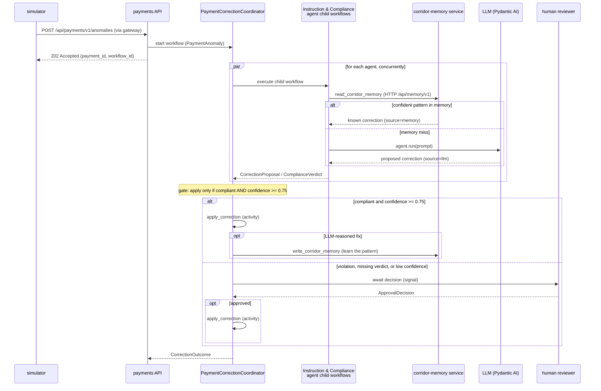

# 00 — Application overview

> **Goal of this step.** Understand *what* the application does, *why* it
> is shaped the way it is, and *how* a single payment flows through it —
> before you run or change anything.

## The problem: broken cross-border payments

Cross-border payments arrive with mistakes. A beneficiary bank's
BIC/SWIFT code is malformed, the required intermediary bank is missing,
or the settlement currency does not match the destination country. Each
of these blocks settlement until someone repairs the payment
instruction.

This application repairs such payments automatically where it safely
can, and escalates to a human where it cannot — using **durable Temporal
workflows** to orchestrate specialized **Pydantic AI agents**, with a
passive **corridor memory** so it stops paying for an LLM call once it
has learned a corridor's fix.

> **Simplified domain — on purpose.** A real cross-border payment carries
> far more than one field. Here, each anomaly targets *exactly one* field
> (a wrong BIC, a missing intermediary bank, or a currency mismatch) so
> the correction logic stays easy to follow and the workshop stays about
> durable execution, not payments compliance. The
> [README](../README.md) documents this simplification. The vocabulary:
>
> - **Corridor** — the ordered country pair the money travels between,
>   e.g. `US->IN` for a US-to-India transfer.
> - **Anomaly** — the single flaw on the payment
>   ([`AnomalyType`](../shared/models.py): `wrong_bic`,
>   `missing_intermediary_bank`, `currency_mismatch`).
> - **Correction** — the proposed fix to the flawed field.

## The two agents and the gate

The heart of the system is a **coordinator** workflow that fans out to
two specialized agents, each running as its own child workflow:

- **Instruction agent** — a payments operations expert. It proposes the
  smallest fix that lets the instruction settle (a valid BIC, the
  required intermediary bank, a consistent routing detail). See its
  definition in [`payments/agents.py`](../payments/agents.py).
- **Compliance agent** — a compliance officer. It does *not* propose a
  fix; it returns a **verdict** on whether a compliant correction is even
  possible (currency must match the corridor destination, no sanctioned
  intermediary).

The coordinator treats compliance as a **gate, not a rival proposal**: it
applies the instruction fix only when the compliance verdict clears it
*and* the confidence is high enough (≥ `0.75`). Anything else — a
violation, a missing verdict, or low confidence — is held (fail-closed).
This logic lives in the `_gate` function in
[`payments/workflows.py`](../payments/workflows.py).

## Passive corridor memory

Before either agent spends a model call, it checks a **corridor memory**:
a store of known `(corridor, anomaly_type) → correction` patterns. If a
confident pattern is known, the agent returns it immediately with
`source=memory` and never touches the LLM. The seeded happy path
(`US->IN` / `wrong_bic`) is fully offline for exactly this reason — you
can run it with no API key.

When the agents *reason out* a new fix and it is applied, the coordinator
**writes the pattern back** so the next matching anomaly on that corridor
skips the model. Memory is a separate HTTP service
([`memory/`](../memory/)), reached over `/api/memory/v1` — never over
Temporal — via the `read_corridor_memory` / `write_corridor_memory`
activities in [`payments/memory.py`](../payments/memory.py).

## The components

The application is a small set of processes, each a Python package with a
thin `main.py` bootstrap. You reach all of them through a single HTTP
gateway.

| Component       | Package                                   | Role                                                                                         |
| --------------- | ----------------------------------------- | -------------------------------------------------------------------------------------------- |
| Shared models   | [`shared/`](../shared/models.py)          | Pydantic models exchanged across the Temporal boundary                                       |
| Payments worker | [`payments/`](../payments/main_worker.py) | Temporal worker: coordinator, agent child workflows, activities                              |
| Payments API    | [`payments/`](../payments/api.py)         | Temporal *client* (no worker): `/api/payments/v1` — start, list, approve                     |
| Corridor memory | [`memory/`](../memory/app.py)             | Separate service & namespace: `/api/memory/v1` over an in-memory store or a durable workflow |
| Web UI          | [`webui/`](../webui/index.html)           | Static homepage — served by the gateway at `/`                                               |
| Codec server    | [`codec/`](../codec/)                     | Decrypts payloads for the Web UI (once encryption is on)                                     |
| Gateway         | [`gateway/`](../gateway/)                 | The single published HTTP entry point                                                        |
| Simulator       | [`simulator/`](../simulator/main.py)      | Client that submits an anomaly                                                               |

Two details are worth internalizing now, because they recur throughout
the guide:

1. **Two namespaces, no shared Temporal.** Payments runs in the
   `payments` namespace; the memory service runs in its own `memory`
   namespace. Payments never calls memory over Temporal — it calls the
   memory HTTP API. Two bounded contexts, cleanly separated.
2. **One entry point.** External callers (including the simulator) only
   ever speak HTTP to the gateway. They never open a Temporal client of
   their own. The gateway routes `/` to our payment-corridor **Web UI**
   (the app front door), `/temporal` to the **Temporal Web UI**,
   `/api/payments/v1` to the payments API, and `/codec` to the codec
   server (see [`gateway/Caddyfile`](../gateway/Caddyfile)). The static
   `webui` homepage is served directly by the gateway at `/`,
   same-origin with the payments API it polls.

## The lifecycle of one correction

Here is what happens when a single payment anomaly is submitted. The
coordinator fans out to both agents concurrently; each tries memory
before the LLM; the coordinator then applies the fix or escalates.

Keep this diagram in mind: every feature you enable in this workshop adds
to, hardens, or observes one edge of it.

## Why durable execution here

Two properties make Temporal the right tool for this domain:

- **Agents that survive crashes.** Each model call is offloaded to a
  Temporal activity by Pydantic AI's Temporal integration, so an agent's
  reasoning survives a worker restart and replays deterministically. You
  never lose an in-flight correction to a redeploy.
- **Human oversight as a first-class state.** A low-confidence correction
  simply *waits* — durably, for as long as you allow — for a human
  decision delivered as a Signal. No queues, no cron, no lost timers.

You will build up to both of these, and more, over the next steps.

---

Next: [01 — Getting started](01-getting-started.md). Read the full
[README](../README.md) any time for the reference documentation.
