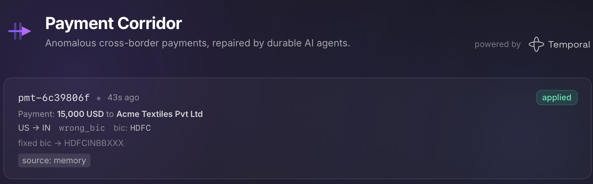
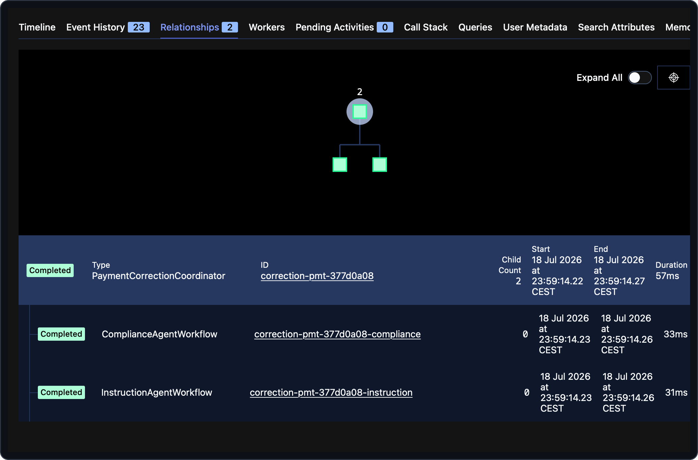

# 01 — Getting started

> [!NOTE]
> **Goal of this step.** Get the whole stack running locally and correct
> your first payment end-to-end — with no API key — so you have a live
> system to explore in every step that follows.

> [!IMPORTANT]
> **Start from a clean baseline.** Each page stands on its own. If you
> enabled features in other steps, reset first so nothing carries over:
>
> ```bash
> make feature-reset
> ```

## Prerequisites

- **Python 3.13+** and [uv](https://docs.astral.sh/uv/).
- **Docker** (or a compatible engine) with Compose — it runs the Temporal
  dev server container.
- The **[Temporal CLI](https://docs.temporal.io/cli)** (`temporal`) — the
  guide runs `temporal workflow …` commands from the host to query,
  signal, filter, and decode workflows (from step
  [03](03-human-approval-signal.md) on) and to capture a replay fixture
  (step [12](12-testing.md)). The dev server runs in Docker, so the CLI is
  a separate install.
- **[jq](https://jqlang.github.io/jq/)** — the guide pipes `curl` output
  through it, starting with this step's outcome fetch below.
- *(Optional, for later steps)* an **LLM provider API key** matching
  `CORRIDOR_MODEL`, e.g. `ANTHROPIC_API_KEY`. You only need it once a
  scenario misses corridor memory and an agent actually calls a model.

No Kubernetes and no cloud account are required.

## Install

```bash
git clone <repository-url>
cd temporal-payment-corridor-workshop
uv sync                 # install dependencies
cp .env.example .env    # optional: every value has a working dev default
```

Everything is configured through environment variables loaded from `.env`
(see [`.env.example`](../.env.example)). The file works as-is; the only
value you must set to exercise the *full* agent flow is a provider key.

## Run the stack

For development, one command brings up the whole stack — the Temporal dev
server, the payments worker and its HTTP API, and the corridor memory
service — with hot reload:

```bash
make dev
```

`make dev` prints a banner with the two URLs you need:

| URL                              | What            |
| -------------------------------- | --------------- |
| <http://localhost:8080>          | The app         |
| <http://localhost:8080/temporal> | Temporal Web UI |

Prefer a fully containerized run instead? `make app-up` brings the whole
stack up in containers and `make app-down` tears it down. For the
workshop, `make dev` is recommended because hot reload picks up the code
changes you make when you enable features.

## Correct your first payment

In a second terminal, fire a payment anomaly:

```bash
make simulator
```

This submits the default `memory-hit` scenario through the gateway. The
simulator prints the accepted identifiers:

```text
scenario: memory-hit
payment : pmt-9f3c1a2b
workflow: correction-pmt-9f3c1a2b
accepted: submitted to http://localhost:8080/api/payments/v1/anomalies
```

> [!IMPORTANT]
> **Always launch the simulator through `make`** so it targets the right
> ports. See [`simulator/main.py`](../simulator/main.py).

The `memory-hit` scenario is `US->IN` with a malformed BIC (`HDFC`). It
matches the pre-seeded corridor pattern in
[`memory/store.py`](../memory/store.py), so **both agents short-circuit
the LLM** and return the fix from memory at confidence `0.95`. No API key
is needed for this path.

## See the correction in the app

Open **the app** at <http://localhost:8080>. Its homepage lists every
correction; your `memory-hit` payment shows as **applied**, with a
`source: memory` pill — corrected from the seeded pattern, no model call.



## Inspect the durable execution in Temporal

For *how* it ran, open the **Temporal Web UI** at
<http://localhost:8080/temporal> and find the
`correction-<payment_id>` workflow. You will see:

- the `PaymentCorrectionCoordinator` execution, and
- two child workflows — `...-instruction` and `...-compliance`.

Click into the coordinator and open its **Event History**. Notice there
are *no model-call activities* on this run — only the two agent
child-workflow executions and the `apply_correction` activity. Open a
child (`...-instruction` or `...-compliance`) and you will find its
`read_corridor_memory` activity but no model call. That is the memory hit
at work.



## Fetch the outcome over HTTP

The simulator only *submits* the anomaly. To read the final outcome, ask
the payments API (through the gateway):

```bash
curl -s http://localhost:8080/api/payments/v1/anomalies/<payment_id> | jq
```

A completed correction returns `applied: true`, the proposal (with
`source: "memory"`), the compliance verdict, and a human-readable
message. The API routes are defined in
[`payments/api.py`](../payments/api.py).

## Try a scenario that reaches the agents

Every scenario other than `memory-hit` deliberately *misses* memory, so
the agents actually call the model — which needs a provider key. List
them:

```bash
make simulator-list
```

| Scenario         | Reaches agents? | What it exercises                                      |
| ---------------- | --------------- | ------------------------------------------------------ |
| `memory-hit`     | no (offline)    | The seeded happy path — corrected from memory          |
| `memory-miss`    | yes             | A wrong BIC on an unknown corridor                     |
| `instruction`    | yes             | An anomaly in the instruction domain                   |
| `compliance`     | yes             | An anomaly in the compliance domain                    |
| `low-confidence` | yes             | Ambiguous details that nudge a low-confidence proposal |
| `needs-approval` | yes             | A compliant fix held for approval on low confidence    |

To run one, set your provider key in `.env` (e.g.
`ANTHROPIC_API_KEY=...`) and pass `SCENARIO`:

```bash
make simulator SCENARIO=memory-miss
```

> [!NOTE]
> **Both agents always run.** A scenario cannot select a single agent;
> `PaymentCorrectionCoordinator` always fans out to both child workflows.
> A scenario only steers which *domain* the anomaly falls in. See the
> caveats in [`simulator/scenarios.py`](../simulator/scenarios.py).

Now watch this run in Temporal: this time the Event History *does*
include the model-call activities that Pydantic AI offloaded from the
agents — durable execution of an LLM call.

## Checkpoint

Before moving on, confirm you can:

- [ ] Bring up the stack with `make dev`.
- [ ] Correct the `memory-hit` payment with `make simulator` (no key).
- [ ] See it as **applied** (source: memory) in the app.
- [ ] Find the coordinator and its two child workflows in Temporal.
- [ ] Fetch the outcome with `curl` against the payments API.

All green? Now dig into *how* it works.

---

Next: [02 — Durable agents & orchestration](02-durable-agents.md).
