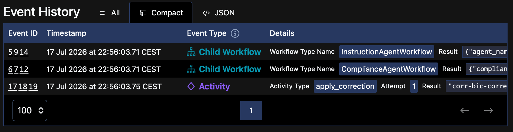

# 02 — Durable agents & orchestration

> [!NOTE]
> **Goal of this step.** Read the baseline application closely. No feature
> to enable here — the point is to understand the coordinator, the two
> agent child workflows, the memory-first flow, the compliance gate, and
> the determinism rules that everything else builds on.

## At a glance

- **Feature:** none — this is the always-on baseline
- **Key files:** [`payments/workflows.py`](../payments/workflows.py),
  [`payments/agents.py`](../payments/agents.py),
  [`payments/activities.py`](../payments/activities.py),
  [`payments/memory.py`](../payments/memory.py),
  [`shared/models.py`](../shared/models.py)
- **Temporal concepts:** Workflows, child workflows, activities, determinism,
  retry policies, fan-out
- **Pydantic AI concepts:** `Agent`, `TemporalAgent`, durable execution on
  Temporal
- **Docs:** [Child workflows](https://docs.temporal.io/develop/python/child-workflows)
  · [Pydantic AI + Temporal](https://ai.pydantic.dev/durable_execution/temporal/)

> [!IMPORTANT]
> **Start from a clean baseline.** Each page stands on its own. If you
> enabled features in other steps, reset first so nothing carries over:
>
> ```bash
> make feature-reset
> ```

## The contract: shared models

Everything that crosses the Temporal boundary — workflow arguments,
activity results, signals, query results — is a plain Pydantic model in
[`shared/models.py`](../shared/models.py). Read these first; they are the
vocabulary of the whole system:

- `PaymentAnomaly` — the incoming flawed payment (corridor, amount,
  currency, `anomaly_type`, free-form `details`).
- `CorrectionProposal` — one agent's proposed fix, carrying a `source`
  (`memory` or `llm`) and a `confidence`.
- `ComplianceVerdict` — the compliance agent's assessment: `compliant`,
  `violations`, `confidence`.
- `CorridorPattern` — the unit stored in corridor memory.
- `ApprovalDecision` — a human's approve/reject verdict (used from step
  [03](03-human-approval-signal.md)).
- `CorrectionOutcome` — the coordinator's final result.

These are deliberately plain so they serialize cleanly across the
boundary.

## The agents: from `Agent` to `TemporalAgent`

Open [`payments/agents.py`](../payments/agents.py). Two Pydantic AI
agents are defined:

- `instruction_agent` — proposes the smallest fix, returning a structured
  `AgentCorrection`.
- `compliance_agent` — returns a `ComplianceCheck` verdict, and is
  instructed *not* to propose a fix.

Each is then wrapped in a `TemporalAgent`:

```python
instruction_temporal_agent = TemporalAgent(
    instruction_agent, model_activity_config=_MODEL_ACTIVITY_CONFIG
)
```

> [!NOTE]
> **The key idea.** The `TemporalAgent` wrapper transparently offloads
> every I/O-bound step (model requests, tool calls) to Temporal
> *activities*. That is what lets an agent run *inside a deterministic
> workflow* and be replayed safely. The `model_activity_config` (a
> `start_to_close_timeout` and a `RetryPolicy`) tunes how those model
> activities retry — so a slow or rate-limited model call is retried
> durably instead of failing the workflow. Read the `NOTE:` on
> `_MODEL_ACTIVITY_CONFIG`.
> Docs: [Pydantic AI activity configuration](https://ai.pydantic.dev/durable_execution/temporal/#activity-configuration).

The model itself is resolved from `CORRIDOR_MODEL` at import time, so you
switch providers without touching code.

## The child workflows

Open [`payments/workflows.py`](../payments/workflows.py). Each agent runs
as its own child workflow:

- `InstructionAgentWorkflow` and `ComplianceAgentWorkflow` both subclass
  `PydanticAIWorkflow` and declare their agent via
  `__pydantic_ai_agents__`.

Their `run` methods delegate to two shared helpers, `_propose` and
`_verify_compliance`. Both implement the **memory-first flow**:

```python
pattern = await workflow.execute_activity(
    read_corridor_memory,
    args=[anomaly.corridor, anomaly.anomaly_type, _beneficiary_bank_id(anomaly)],
    start_to_close_timeout=timedelta(seconds=10),
)
if pattern is not None and pattern.confidence >= CONFIDENCE_THRESHOLD:
    return CorrectionProposal(..., source=CorrectionSource.MEMORY)
result = await agent.run(_prompt(anomaly))   # only on a miss
```

Read the `NOTE:` on `_verify_compliance`: a known high-confidence pattern
is presumed compliant *without a model call*, which is exactly what keeps
the seeded `US->IN` / `wrong_bic` happy path fully offline — neither
agent calls the model.

> [!NOTE]
> **Determinism, in practice.** Notice the HTTP call to memory does not
> happen in workflow code — it happens in the `read_corridor_memory`
> *activity* ([`payments/memory.py`](../payments/memory.py)). Workflow
> code must stay deterministic: no wall-clock, no network, no randomness.
> All I/O lives in activities or inside the durable agents. The module
> docstring at the top of `workflows.py` states this rule, and
> `imports_passed_through()` is how non-workflow modules (like the
> `TemporalAgent` instances) reach the sandbox as real objects.

## The coordinator

`PaymentCorrectionCoordinator.run` is the parent workflow. Walk through
its body:

1. **Fan out to both agents concurrently** as child workflows, with
   `asyncio.gather(..., return_exceptions=True)`:

   ```python
   results = await asyncio.gather(
       workflow.execute_child_workflow(InstructionAgentWorkflow.run, ...),
       workflow.execute_child_workflow(ComplianceAgentWorkflow.run, ...),
       return_exceptions=True,
   )
   ```

   Read the `NOTE:` above it: `return_exceptions=True` makes the fan-out
   *resilient* — one agent failing degrades gracefully instead of failing
   the whole correction. Each child also gets an explicit
   `execution_timeout` so a hung agent cannot stall the coordinator.
   Docs: [Child workflows](https://docs.temporal.io/develop/python/child-workflows).

2. **Gate the result** with the `_gate` helper. This is the design idea to
   internalize:

   > **Compliance is a gate, not a competing proposer.** A fix is applied
   > only when the verdict clears it *and* the proposal is confident
   > enough (≥ `CONFIDENCE_THRESHOLD`, `0.75`). A missing clearance — the
   > compliance agent failed, or reported a violation — never
   > auto-applies. It is **fail-closed**: it holds for a human.

   The `_gate` function returns one of three `GateDecision` values:
   `APPLY`, `REVIEW` (hold for a human), or `NO_PROPOSAL`.

3. **Apply the fix** in an activity, with a bounded timeout and a retry
   policy:

   ```python
   reference = await workflow.execute_activity(
       apply_correction,
       proposal,
       start_to_close_timeout=timedelta(seconds=30),
       retry_policy=RetryPolicy(maximum_attempts=3),
   )
   ```

4. **Learn the pattern** — but only when the fix was *reasoned out* by the
   LLM, not recalled from memory. The `_learned_pattern` helper returns
   `None` for a memory-sourced proposal (writing it back would just echo
   what was read). The write-back is best-effort: it is wrapped in a
   `try/except ActivityError` so a memory hiccup never fails an
   already-applied correction.

In the baseline, a `REVIEW` decision simply returns `applied=False` with
the gate's reason — there is no human oversight wired up *yet*. That is
what step [03](03-human-approval-signal.md) adds.

## The side effects: activities

Open [`payments/activities.py`](../payments/activities.py). Activities are
where side effects live, and where **application metrics** are emitted
(through `activity.metric_meter()`, which surfaces on the one Prometheus
endpoint — see step [11](11-observability.md)).

Study `apply_correction` and its `NOTE:` on idempotency:

> [!NOTE]
> **Idempotency.** The applied-correction reference is derived from the
> coordinator's (unique) workflow id, *not* from a hash. Activities can
> run more than once (worker crash, transient failure, retry), so their
> external effects must be idempotent: a retried or replayed activity must
> yield the *same* reference so the downstream system can dedupe instead
> of double-applying.
> Docs: [Activity idempotency](https://docs.temporal.io/activities#idempotency).

## Run it and map code to history

Fire the offline scenario and follow it in the Temporal Web UI:

```bash
make simulator
```

Open the `correction-<payment_id>` coordinator in Temporal and match its
Event History to the code you just read:

- two `StartChildWorkflowExecution` events (the fan-out),
- inside each child, a `read_corridor_memory` activity (the memory hit —
  no model activity on this scenario),
- an `apply_correction` activity in the parent,
- **no** `write_corridor_memory` (the fix came from memory, so nothing new
  to learn).



Now run an agent scenario (needs a provider key) and compare:

```bash
make simulator SCENARIO=memory-miss
```

This time the child workflows' Event History *does* include the Pydantic AI
model activities — durable execution of an LLM call, offloaded from the
agents. What happens next is decided by the gate. `memory-miss` settles USD
into a `US->GB` corridor, so the compliance agent flags a currency mismatch
(GB expects GBP) — the same unambiguous violation step
[03](03-human-approval-signal.md) examines. The gate is fail-closed, so the
correction is *held* (`applied=false`, no write-back) — regardless of how
confident the instruction agent's proposal is.

The applied branch is the mirror image: when a reasoned-out fix *clears* the
gate (compliant *and* confidence ≥ `CONFIDENCE_THRESHOLD`), the coordinator
applies it and — because the fix was reasoned out, not recalled — runs a
`write_corridor_memory` activity in the parent; submit the *same* corridor
again and it resolves from memory. The reliable way to reach that path is to
approve a held correction once `human-approval-signal` is on (step
[03](03-human-approval-signal.md)): approving applies the fix and triggers
the write-back.

## Live demo: crash & resume

Steps 00 and 02 claim a correction survives a worker crash. Here you
stage it and watch it happen — on the plain baseline, no feature needed.

> [!NOTE]
> Start from a clean baseline (`make feature-reset`) with the stack up via
> `make dev`, and a provider API key configured. The demo needs the
> (slower) LLM activity to leave a window to interrupt; the offline
> `memory-hit` scenario finishes too fast to catch.

1. Start a correction that calls the model:

   ```bash
   make simulator SCENARIO=memory-miss
   ```

   Expect: a new `correction-<payment_id>` coordinator, status Running,
   fanned out to two agent child workflows.

2. Open that coordinator in the Temporal Web UI.

   Expect: both agents running; inside a child workflow, an
   `agent__instruction_agent__model_request` activity is scheduled (the
   durable LLM call).

3. Crash it — press Ctrl-C in the terminal running `make dev`.

   Expect: the worker, API, and memory service stop, but the Temporal
   server keeps running, so the coordinator stays Running and the model
   activity is left pending with no worker to run it (no pollers).

4. Bring it back:

   ```bash
   make dev
   ```

   Expect: the worker re-polls, picks up the pending activity, and the
   correction finishes — status Completed. It was never restarted from
   scratch.

5. Inspect the resume: in the child workflow's Event History, compare the
   model activity's Scheduled and Started times.

   Expect: a gap of tens of seconds spanning exactly the outage. The
   activity waited durably in the task queue while no worker existed, then
   the restarted worker drained it. Nothing was lost.

> [!NOTE]
> The workflow's state lives in Temporal, not in the worker: an in-flight
> activity survives the worker's death and resumes on its own.

> [!IMPORTANT]
> `memory-miss` leaves roughly a 20–30 second window. If the coordinator
> already shows Completed, you were too quick — just run the simulator
> again.

## Checkpoint

- [ ] You can point to where determinism is preserved (I/O in activities,
      not workflow code).
- [ ] You can explain why compliance is a *gate*, not a competing
      proposal.
- [ ] You can explain why only LLM-sourced fixes are written back to
      memory.
- [ ] You matched a coordinator's Event History to the code that produced
      it.

---

Next: [03 — Human-in-the-loop with Signals](03-human-approval-signal.md).
