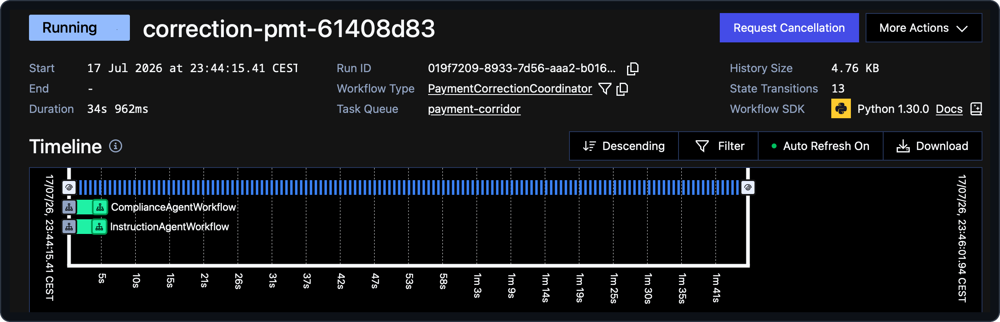

# 03 — Human-in-the-loop with Signals

> **Goal of this step.** Turn a held, low-confidence correction into one
> that *waits* — durably — for a human's approve/reject decision delivered
> as a Temporal **Signal**, and expose that waiting state through
> **Queries**.

## At a glance

|                       |                                                                                                                                                                               |
| --------------------- | ----------------------------------------------------------------------------------------------------------------------------------------------------------------------------- |
| **Feature**           | `human-approval-signal`                                                                                                                                                       |
| **Files touched**     | [`payments/workflows.py`](../payments/workflows.py), [`payments/api.py`](../payments/api.py), [`payments/test_workflows.py`](../payments/test_workflows.py)                   |
| **Temporal concepts** | Signals, Queries, `wait_condition`, message passing                                                                                                                           |
| **Docs**              | [Message passing](https://docs.temporal.io/develop/python/message-passing) · [Send a Signal](https://docs.temporal.io/develop/python/message-passing#send-signal-from-client) |
| **Builds on**         | step [02](02-durable-agents.md)                                                                                                                                               |

## Why this matters

In the baseline, a `REVIEW` gate decision is a dead end: the coordinator
just returns `applied=False`. But "hold for a human" should mean *actually
wait for a human*. Temporal makes that a first-class, durable state: the
workflow blocks on `wait_condition` until a **Signal** delivers the
decision — for minutes or for days — surviving worker restarts the whole
time. Meanwhile a **Query** lets clients ask "are you waiting?" without
disturbing the workflow.

## Step 1 — Preview the change

See exactly what enabling this feature will uncomment, without touching
anything:

```bash
make feature-diff NAME=human-approval-signal
```

## Step 2 — Enable it

```bash
make feature-enable NAME=human-approval-signal
```

With `make dev` running, hot reload restarts the affected processes
automatically.

## Step 3 — Read the newly-live code

**In [`payments/workflows.py`](../payments/workflows.py):** the `REVIEW`
branch now waits instead of refusing. The core is:

```python
self._awaiting = True
_set_status("awaiting-approval")
await workflow.wait_condition(
    lambda: self._decision is not None, timeout=_APPROVAL_TIMEOUT
)
```

Read the `NOTE:` blocks and note three things:

- The coordinator now exposes a **signal** and two **queries** at the
  bottom of the class:
  - `approve_correction(decision)` — the signal a reviewer sends.
  - `decision()` — returns the stored decision.
  - `awaiting_approval()` — returns whether it is currently blocked.
- `_APPROVAL_TIMEOUT` defaults to `None` (wait forever). Step
  [04](04-approval-timeout.md) turns it into a real deadline.
- The waiting state is published through **two seams**: the in-memory
  `_awaiting` flag (read by the `awaiting_approval` query) and the status
  Search Attribute via `_set_status(...)` (a no-op until step
  [08](08-search-attributes.md)). A `finally` block resets both once the
  wait resolves.

**In [`payments/api.py`](../payments/api.py):** a new route relays the
decision as a signal:

```python
@app.post("/api/payments/v1/anomalies/{payment_id}/approval", ...)
async def approve_anomaly(payment_id: str, decision: ApprovalDecision) -> None:
    handle = client.get_workflow_handle(_workflow_id(payment_id))
    await handle.signal(PaymentCorrectionCoordinator.approve_correction, decision)
```

Read its `NOTE:` — this is a *fire-and-forget* signal: it returns once
delivered; the coordinator resumes and finishes asynchronously. The
`_query_awaiting` helper also switches from a stub to a real query call,
so the listing endpoint can report which corrections are blocked.

## Step 4 — Run and observe

You need a correction that the gate *holds*. The `low-confidence`
scenario is designed to nudge the model toward a sub-threshold proposal
(it needs a provider key and is best-effort — see
[`simulator/scenarios.py`](../simulator/scenarios.py)):

```bash
make simulator SCENARIO=low-confidence
```

In the Web UI, open the coordinator. With the feature enabled it no longer
completes — it is **Running**, blocked on `wait_condition`. Query its
state from the CLI:

```bash
temporal workflow query \
  --workflow-id correction-<payment_id> \
  --namespace payments \
  --type awaiting_approval
```



Now approve it — either through the gateway API:

```bash
curl -X POST \
  http://localhost:8080/api/payments/v1/anomalies/<payment_id>/approval \
  -H 'content-type: application/json' \
  -d '{"approved": true, "approver": "ops@bank.example"}'
```

or straight from the Temporal CLI as a raw signal:

```bash
temporal workflow signal \
  --workflow-id correction-<payment_id> \
  --namespace payments \
  --name approve_correction \
  --input '{"approved": true, "approver": "ops@bank.example"}'
```

The coordinator wakes, applies the correction (or records the rejection),
and completes. Fetch the outcome:

```bash
curl -s http://localhost:8080/api/payments/v1/anomalies/<payment_id> | jq
```

> **Who sends the approval?** Not the simulator — it only submits the
> anomaly and returns. The decision arrives *out-of-band* from a separate
> client (an ops process, or you via CLI). The teaching aside in
> [`simulator/main.py`](../simulator/main.py) spells this out.

## Step 5 — Checkpoint

- [ ] A low-confidence correction stays **Running**, blocked on a human.
- [ ] `awaiting_approval` query returns `true` while it waits.
- [ ] Approving via the API *or* the CLI signal resumes and completes it.

## Revert

```bash
make feature-disable NAME=human-approval-signal
```

---

Next: [04 — Bounded waiting with durable timers](04-approval-timeout.md).
