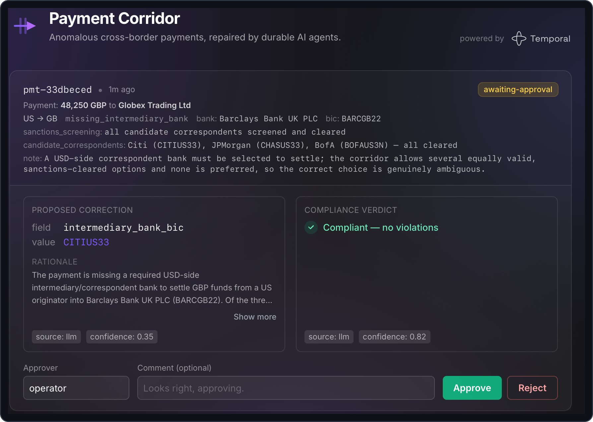
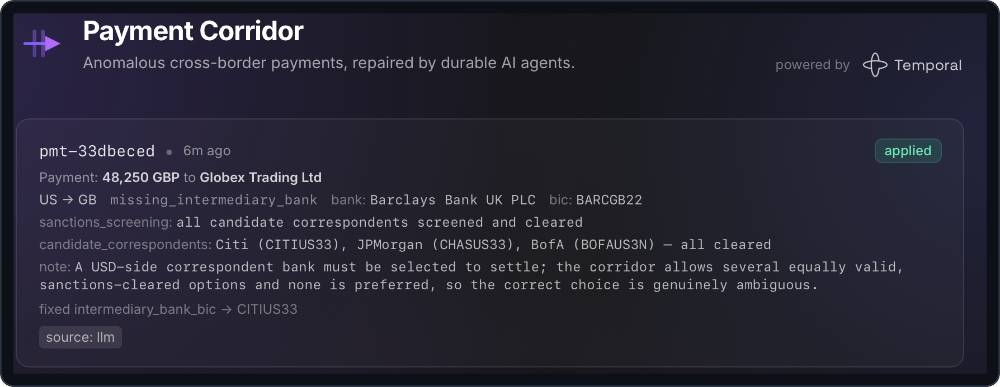

# 03 — Human-in-the-loop with Signals

> [!NOTE]
> **Goal of this step.** Turn a held, low-confidence correction into one
> that *waits* — durably — for a human's approve/reject decision delivered
> as a Temporal **Signal**, and expose that waiting state through
> **Queries**.

## At a glance

- **Feature:** `human-approval-signal`
- **Files touched:** [`shared/models.py`](../shared/models.py),
  [`payments/workflows.py`](../payments/workflows.py),
  [`payments/api.py`](../payments/api.py),
  [`payments/test_workflows.py`](../payments/test_workflows.py),
  [`payments/test_api.py`](../payments/test_api.py)
- **Temporal concepts:** Signals, Queries, `wait_condition`, message passing
- **Docs:** [Message passing](https://docs.temporal.io/develop/python/message-passing)
  · [Send a Signal](https://docs.temporal.io/develop/python/message-passing#send-signal-from-client)
- **Builds on:** step [02](02-durable-agents.md)

> [!IMPORTANT]
> **Start from a clean baseline.** Each page stands on its own. If you
> enabled features in other steps, reset first so nothing carries over:
>
> ```bash
> make feature-reset
> ```

## Why this matters

In the baseline, a `REVIEW` gate decision is a dead end: the coordinator
just returns `applied=False`. But "hold for a human" should mean *actually
wait for a human*. Temporal makes that a first-class, durable state: the
workflow blocks on `wait_condition` until a **Signal** delivers the
decision — for minutes or for days — surviving worker restarts the whole
time. Meanwhile a **Query** lets clients ask "are you waiting?" without
disturbing the workflow.

## Step 1 — Preview the change

See exactly what enabling this feature will uncomment, without touching
anything:

```bash
make feature-diff NAME=human-approval-signal
```

## Step 2 — Enable it

```bash
make feature-enable NAME=human-approval-signal
```

With `make dev` running, hot reload restarts the affected processes
automatically.

## Step 3 — Read the newly-live code

**In [`payments/workflows.py`](../payments/workflows.py):** the `REVIEW`
branch now waits instead of refusing. The core is:

```python
self._awaiting = True
_set_status("awaiting-approval")
self._review = ReviewState(proposal=proposal, verdict=verdict)
await workflow.wait_condition(
    lambda: self._decision is not None, timeout=_APPROVAL_TIMEOUT
)
```

Read the `NOTE:` blocks and note three things:

- The coordinator now exposes a **signal** and three **queries** at the
  bottom of the class:
  - `approve_correction(decision)` — the signal a reviewer sends.
  - `decision()` — returns the stored decision.
  - `awaiting_approval()` — returns whether it is currently blocked.
  - `pending_review()` — returns the pending `ReviewState` (proposal and
    verdict) the approval panel renders, or `None` when not awaiting.
- `_APPROVAL_TIMEOUT` defaults to `None` (wait forever). Step
  [04](04-approval-timeout.md) turns it into a real deadline.
- The waiting state is exposed through the `awaiting_approval` query, and a
  `finally` block clears it once the wait resolves.

**In [`payments/api.py`](../payments/api.py):** a new route relays the
decision as a signal:

```python
@app.post("/api/payments/v1/anomalies/{payment_id}/approval", ...)
async def approve_anomaly(payment_id: str, decision: ApprovalDecision) -> None:
    handle = client.get_workflow_handle(_workflow_id(payment_id))
    await handle.signal(PaymentCorrectionCoordinator.approve_correction, decision)
```

Read its `NOTE:` — this is a *fire-and-forget* signal: it returns once
delivered; the coordinator resumes and finishes asynchronously.

## Step 4 — Run and observe

You need a correction that the gate *holds*. The `needs-approval`
scenario is built for exactly that: a **compliant** correction whose
instruction fix is too ambiguous to auto-apply, so it lands sub-threshold
and holds for a human (it needs a provider key and is best-effort — see
[`simulator/scenarios.py`](../simulator/scenarios.py)):

```bash
make simulator SCENARIO=needs-approval
```

Open **the app** at <http://localhost:8080>. The correction shows as
**awaiting-approval**: an approval panel with the proposed fix beside the
compliance verdict and Approve / Reject controls. Because `needs-approval`
produces a *compliant* correction, the verdict reads **Compliant — no
violations** even though the fix still waits on a human decision:



Behind that panel the coordinator is **durably waiting**. In the **Temporal
Web UI**, open the coordinator: with the feature enabled it no longer
completes — it is **Running**, blocked on `wait_condition`. The
`awaiting_approval` **Query** answers "are you waiting?" without disturbing
it — exactly the question the app's panel is built on:

```bash
temporal workflow query \
  --workflow-id correction-<payment_id> \
  --namespace payments \
  --type awaiting_approval
```


Now record a decision. **In the app, click Approve** (or Reject) on the
panel — the primary path: the app POSTs an `ApprovalDecision` that the
payments API relays to the coordinator as the `approve_correction`
**Signal** (the route you read in Step 3).

That decision is *just a Signal* — a message deliverable from anywhere, not
only the app. To see that, send one by hand from the Temporal CLI instead
of clicking:

```bash
temporal workflow signal \
  --workflow-id correction-<payment_id> \
  --namespace payments \
  --name approve_correction \
  --input '{"approved": true, "approver": "ops@bank.example"}'
```

The coordinator wakes, applies the correction (or records the rejection),
and completes. In the app the row flips from **awaiting-approval** to
**applied** (or **held** on a reject), the final outcome shown inline:



> [!NOTE]
> **Who sends the approval?** Not the simulator — it only submits the
> anomaly and returns. The decision arrives *out-of-band* from a separate
> client: the operator clicking in the app, an ops process POSTing to the
> gateway, or you sending the raw Signal from the CLI. The teaching aside in
> [`simulator/main.py`](../simulator/main.py) spells this out.

## Step 5 — Checkpoint

- [ ] A `needs-approval` correction stays **Running**, blocked on a human.
- [ ] `awaiting_approval` query returns `true` while it waits.
- [ ] Approving in the app *or* via the raw CLI Signal resumes and completes it.

## Revert

```bash
make feature-disable NAME=human-approval-signal
```

---

Next: [04 — Bounded waiting with durable timers](04-approval-timeout.md).
