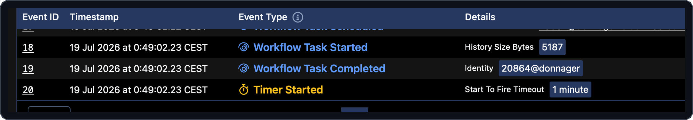
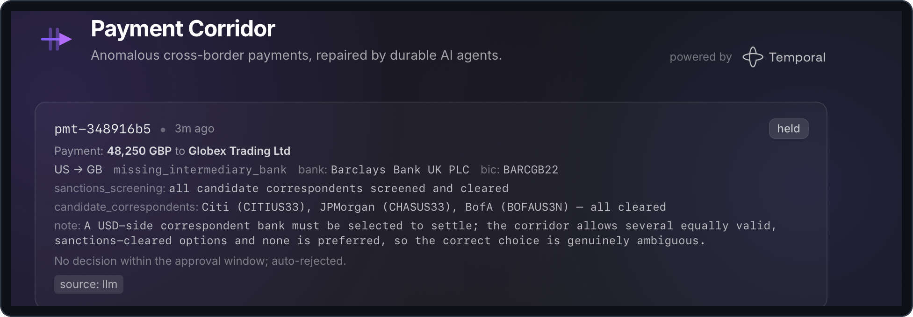

# 04 — Bounded waiting with durable timers

> [!NOTE]
> **Goal of this step.** Stop waiting *forever* for a human. Give the
> approval wait a deadline with a **durable timer**, so an unanswered
> correction auto-rejects instead of blocking indefinitely.

## At a glance

- **Feature:** `approval-timeout`
- **Files touched:** [`payments/workflows.py`](../payments/workflows.py)
- **Temporal concepts:** Durable timers, `wait_condition(timeout=...)`,
  `asyncio.TimeoutError`
- **Docs:** [Timers](https://docs.temporal.io/develop/python/timers)
- **Requires:** `human-approval-signal` (step [03](03-human-approval-signal.md))
  enabled, plus a provider API key — `needs-approval` reaches the agents (see
  [`.env.example`](../.env.example) and step [01](01-getting-started.md))

> [!IMPORTANT]
> **Start from a clean baseline.** Each page stands on its own. If you
> enabled features in other steps, reset first so nothing carries over:
>
> ```bash
> make feature-reset
> ```

## Why this matters

A human-in-the-loop step that can wait forever is an operational risk: a
correction blocked on a reviewer who never responds sits Running
indefinitely. The fix is a **durable timer**. Unlike an in-process
`sleep`, a Temporal timer is workflow state — it survives worker
restarts, and it fires deterministically. Bounding the approval wait turns
"wait forever" into "wait, then auto-reject."

> [!IMPORTANT]
> `approval-timeout` only changes the timeout constant that the approval
> wait from `human-approval-signal` (step
> [03](03-human-approval-signal.md)) already uses, so you need that feature
> on as well. Starting from a clean baseline, Step 2 enables both.

## Step 1 — Preview the change

```bash
make feature-diff NAME=approval-timeout
```

## Step 2 — Enable it

From a clean baseline (no features on), enable `human-approval-signal`
first — it provides the approval wait — then `approval-timeout`, which
bounds it:

```bash
make feature-enable NAME=human-approval-signal
make feature-enable NAME=approval-timeout
```

## Step 3 — Read the newly-live code

This feature is small and precise. In
[`payments/workflows.py`](../payments/workflows.py) it *replaces* the
timeout constant. The baseline (`FEATURE-OFF`) block is:

```python
_APPROVAL_TIMEOUT: timedelta | None = None   # wait forever
```

Enabling swaps in the `FEATURE-ON` block:

```python
_APPROVAL_TIMEOUT: timedelta | None = timedelta(minutes=1)
```

Read its `NOTE:` and trace how it is used back in the `REVIEW` branch of
`PaymentCorrectionCoordinator.run`:

```python
try:
    await workflow.wait_condition(
        lambda: self._decision is not None, timeout=_APPROVAL_TIMEOUT
    )
except asyncio.TimeoutError:
    return CorrectionOutcome(..., applied=False,
        message="No decision within the approval window; auto-rejected.")
```

> [!NOTE]
> **The key idea.** `wait_condition(timeout=...)` arms a **durable timer**.
> When the deadline elapses it raises `asyncio.TimeoutError`, which the
> coordinator turns into an auto-reject outcome. The timer is workflow
> state like any other, so it keeps counting across worker restarts —
> there is no background thread to lose.
> Docs: [Timers](https://docs.temporal.io/develop/python/timers).

This is a `REPLACE`-style feature: it pairs a `FEATURE-ON` block with an
inverse `FEATURE-OFF` block, so disabling restores the wait-forever
baseline cleanly.

## Step 4 — Run and observe

Trigger a held correction and then *do nothing*. The `needs-approval`
scenario reaches the agents, so it needs a provider API key (see step
[01](01-getting-started.md)); without one the correction can't reach the
`REVIEW` branch and no timer is armed:

```bash
make simulator SCENARIO=needs-approval   # needs a provider key
```

In the **Temporal Web UI**, open the coordinator. Its Event History now
contains a **Timer** event started when it entered the `REVIEW` branch.



For a fast demo you can temporarily shorten the window in the enabled
`FEATURE-ON` block (e.g. `timedelta(seconds=20)`); hot reload picks it up,
though a workflow already running keeps the timer it was started with.
Once the window elapses without an approval, the coordinator fires the
timer, catches `asyncio.TimeoutError`, and completes with the auto-reject
message. In the app the row turns **held**, its summary reading "No
decision within the approval window; auto-rejected.":



To see the *other* branch, run another `needs-approval` correction and
approve it **in the app** (step [03](03-human-approval-signal.md)) *before*
the window elapses — the timer is cancelled and the correction is applied.

## Step 5 — Checkpoint

- [ ] A held correction now shows a **Timer** in its Event History.
- [ ] Left unanswered, it auto-rejects with the approval-window message.
- [ ] Approved in time, it applies normally (timer cancelled).

## Revert

```bash
make feature-disable NAME=approval-timeout
make feature-disable NAME=human-approval-signal
```

---

Next: [05 — Classifying failures](05-non-retryable-validation.md).
