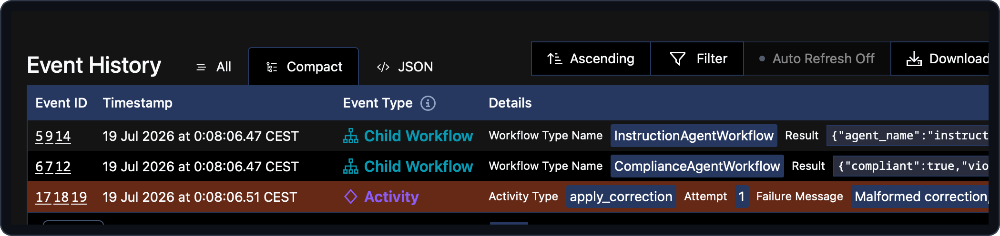

# 05 — Classifying failures: retryable vs non-retryable

> **Goal of this step.** Learn when *not* to retry. Make a malformed
> correction fail *immediately and permanently* instead of burning the
> retry budget on an error that can never self-heal.

> **Start from a clean baseline.** Each page stands on its own. If you
> enabled features in other steps, reset first so nothing carries over:
>
> ```bash
> make feature-reset
> ```

## At a glance

|                       |                                                                                           |
| --------------------- | ----------------------------------------------------------------------------------------- |
| **Feature**           | `non-retryable-validation`                                                                |
| **Files touched**     | [`payments/activities.py`](../payments/activities.py)                                     |
| **Temporal concepts** | `ApplicationError(non_retryable=True)`, retry policies, failure classification            |
| **Docs**              | [Non-retryable errors](https://docs.temporal.io/references/failures#non-retryable-errors) |
| **Builds on**         | step [02](02-durable-agents.md)                                                           |

## Why this matters

Temporal retries failed activities by default — which is exactly right for
*transient* failures (a network blip, a rate limit). But some failures are
**permanent**: a malformed BIC will still be malformed on attempt three.
Retrying it wastes time and the retry budget, and delays surfacing the
real problem. The tool for this is
`ApplicationError(non_retryable=True)`: it tells Temporal to fail the
activity at once and skip the remaining attempts.

Recall from step [02](02-durable-agents.md) that the coordinator attaches
`RetryPolicy(maximum_attempts=3)` to `apply_correction`. That policy only
helps for transient failures. This step shows the deliberate contrast.

## Step 1 — Preview the change

```bash
make feature-diff NAME=non-retryable-validation
```

## Step 2 — Enable it

```bash
make feature-enable NAME=non-retryable-validation
```

## Step 3 — Read the newly-live code

In [`payments/activities.py`](../payments/activities.py), `apply_correction`
gains a validation guard, plus a small BIC format checker (`_is_valid_bic`)
and a hand-operated fault switch (`_SIMULATE_INVALID_CORRECTION`):

```python
if _SIMULATE_INVALID_CORRECTION or not _is_valid_bic(proposal.proposed_value):
    raise ApplicationError(
        f"Malformed correction, refusing to apply: {proposal.proposed_value!r}",
        non_retryable=True,
    )
```

Read the `NOTE:` blocks:

> **The key idea.** `non_retryable=True` fails the activity immediately and
> skips the remaining retry attempts. Use it for errors that can never
> succeed on a retry (bad input, validation failures), as opposed to
> transient ones (a network blip) that the `RetryPolicy` is meant to
> absorb.
> Docs: [Non-retryable errors](https://docs.temporal.io/references/failures#non-retryable-errors).

Also note `_is_valid_bic` is a deliberately lightweight *format* screen
(length + character classes per ISO 9362), **not** a lookup against the
official SWIFT/BIC registry — its `NOTE:` says so. That distinction (cheap
structural check vs authoritative lookup) is itself a production lesson.

## Step 4 — Run and observe

The seeded happy path stays green (its correction is a valid BIC). To see
the non-retryable path, flip the hand-operated fault switch: set
`_SIMULATE_INVALID_CORRECTION = True` in
[`payments/activities.py`](../payments/activities.py) (hot reload picks it
up), then fire a correction that reaches the apply step:

```bash
make simulator            # memory-hit still reaches apply_correction
```

In the Web UI, open the coordinator and the `apply_correction` activity.
You will see it fail on **attempt 1** and *not* retry — even though the
coordinator's policy allows three attempts. The failure is an
`ApplicationError` marked non-retryable.



Contrast this deliberately with the *next* step, where a **retryable**
failure does climb through the attempts. When you are done, set
`_SIMULATE_INVALID_CORRECTION` back to `False`.

## Step 5 — Checkpoint

- [ ] A malformed correction fails on attempt 1 with no retries.
- [ ] You can explain why that is correct here, and why the transient case
      (next step) is different.
- [ ] You can articulate the difference between a format screen and an
      authoritative registry lookup.

## Revert

```bash
make feature-disable NAME=non-retryable-validation
```

---

Next: [06 — Reacting to retries with metrics](06-retry-alerting.md).
