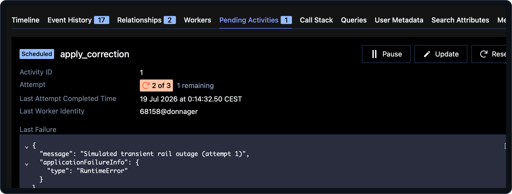

# 06 — Reacting to retries with metrics

> **Goal of this step.** See the *other* side of failure handling: a
> **transient** error that Temporal retries. Detect that retries are
> piling up (via `activity.info().attempt`) and raise an operational alert
> through a custom metric — while the correction still succeeds.

## At a glance

|                       |                                                                                                                                                            |
| --------------------- | ---------------------------------------------------------------------------------------------------------------------------------------------------------- |
| **Feature**           | `retry-alerting`                                                                                                                                           |
| **Files touched**     | [`payments/activities.py`](../payments/activities.py)                                                                                                      |
| **Temporal concepts** | `activity.info().attempt`, retryable errors, custom metrics                                                                                                |
| **Docs**              | [Activity retries](https://docs.temporal.io/references/failures#activity-retries) · [Observability](https://docs.temporal.io/develop/python/observability) |
| **Builds on**         | steps [02](02-durable-agents.md) and [05](05-non-retryable-validation.md)                                                                                  |

## Why this matters

Retries hide transient failures — which is the point. But *silent* retries
also hide a rail that is degrading. An activity can notice it is being
retried (`activity.info().attempt` starts at 1 and the server increments
it on every retry) and react — here, by emitting a metric once retries
cross a threshold. A climbing counter can then drive a dashboard or an
alert rule, all through the same Prometheus endpoint that already serves
the app's metrics (see step [11](11-observability.md)).

This is the deliberate counterpart to step
[05](05-non-retryable-validation.md): there the error was permanent and
retries were wrong; here the error is transient and retries are right —
you just want to be *told* when they happen.

## Step 1 — Preview the change

```bash
make feature-diff NAME=retry-alerting
```

## Step 2 — Enable it

```bash
make feature-enable NAME=retry-alerting
```

## Step 3 — Read the newly-live code

In [`payments/activities.py`](../payments/activities.py), `apply_correction`
gains a retry-aware block plus two knobs: a hand-operated fault switch
(`_SIMULATE_TRANSIENT_RAIL_OUTAGE`) and a configurable threshold
(`_RETRY_ALERT_THRESHOLD`, read from the environment). The core:

```python
attempt = activity.info().attempt
if attempt >= _RETRY_ALERT_THRESHOLD:
    alerted = meter.create_counter(
        "corridor_correction_retries_alerted",
        "Corrections whose retries crossed the alert threshold",
    )
    alerted.add(1, {"field": proposal.field_to_fix, "source": proposal.source})
if _SIMULATE_TRANSIENT_RAIL_OUTAGE and attempt < _RETRY_ALERT_THRESHOLD + 1:
    raise RuntimeError(f"Simulated transient rail outage (attempt {attempt})")
```

Read the `NOTE:` blocks:

> **The key idea.** A *plain* exception is **retryable** by default (only
> `ApplicationError(non_retryable=True)` or exhausting the `RetryPolicy`
> stops the retries). So `RuntimeError` here is retried per the
> coordinator's `maximum_attempts=3` policy. Bounding the simulated outage
> to `attempt < _RETRY_ALERT_THRESHOLD + 1` lets the correction still
> succeed within three attempts — *after* the alert has fired.
> Docs: [Retryable vs non-retryable](https://docs.temporal.io/references/failures#retryable-vs-non-retryable).

Note the metric is tagged `field` + `source`, matching the sibling
`corridor_*` counters, because corridor/anomaly-type are not carried on
`CorrectionProposal`.

## Step 4 — Run and observe

Flip the fault switch: set `_SIMULATE_TRANSIENT_RAIL_OUTAGE = True` in
[`payments/activities.py`](../payments/activities.py) (hot reload picks it
up). The default threshold is `2` (tune with
`CORRIDOR_RETRY_ALERT_THRESHOLD`). Then fire a correction that reaches the
apply step:

```bash
make simulator
```

In the Web UI, open the `apply_correction` activity and watch it fail on
attempts 1 (and 2, depending on the threshold), then **succeed** — the
correction completes.



Now confirm the alert metric climbed. Scrape the endpoint:

```bash
curl -s http://localhost:9464/metrics | grep corridor_correction_retries_alerted
```

You will also see the Temporal SDK's own retry metrics (`temporal_*`)
alongside the app's (`corridor_*`) — one endpoint, both families. Set
`_SIMULATE_TRANSIENT_RAIL_OUTAGE` back to `False` when done.

## Step 5 — Checkpoint

- [ ] A transient failure is retried and the correction still completes.
- [ ] `corridor_correction_retries_alerted` appears and increments.
- [ ] You can explain why this error is retryable while step 05's was not.

## Revert

```bash
make feature-disable NAME=retry-alerting
```

---

Next: [07 — Long-running activities & heartbeats](07-settlement-confirmation.md).
