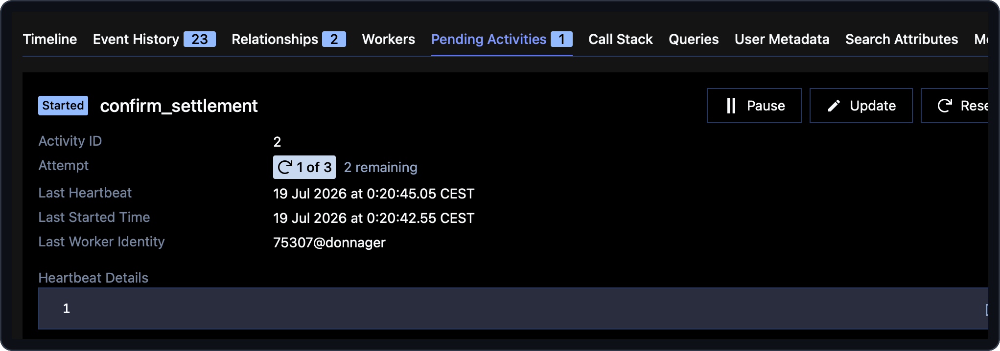

# 07 — Long-running activities & heartbeats

> **Goal of this step.** Add a step that waits for the downstream rail to
> actually *settle*. Along the way, meet the three ideas that make
> long-running work safe: **heartbeats**, **cancellation**, and — because
> this changes the coordinator's shape — **replay & versioning**.

> **Start from a clean baseline.** Each page stands on its own. If you
> enabled features in other steps, reset first so nothing carries over:
>
> ```bash
> make feature-reset
> ```

## At a glance

|                       |                                                                                                                                                                                                                                                                     |
| --------------------- | ------------------------------------------------------------------------------------------------------------------------------------------------------------------------------------------------------------------------------------------------------------------- |
| **Feature**           | `settlement-confirmation`                                                                                                                                                                                                                                           |
| **Files touched**     | [`payments/workflows.py`](../payments/workflows.py), [`payments/activities.py`](../payments/activities.py), [`payments/worker.py`](../payments/worker.py), [`shared/models.py`](../shared/models.py), [`payments/test_workflows.py`](../payments/test_workflows.py) |
| **Temporal concepts** | Long-running activities, `activity.heartbeat`, `heartbeat_timeout`, cancellation, replay & versioning                                                                                                                                                               |
| **Docs**              | [Detecting activity failures](https://docs.temporal.io/encyclopedia/detecting-activity-failures#activity-heartbeat) · [Cancellation](https://docs.temporal.io/develop/python/cancellation) · [Versioning](https://docs.temporal.io/develop/python/versioning)       |
| **Builds on**         | step [02](02-durable-agents.md)                                                                                                                                                                                                                                     |

## Why this matters

Applying a correction is not the end of the story: the money still has to
settle on the downstream rail, which is *asynchronous* and can take a
while. The right shape is a **long-running, heartbeating activity** that
polls the rail. From the workflow's point of view it is just another
activity to `await`, so determinism is preserved — but the activity now
reports progress, can be resumed after a crash, and can be cancelled.

## Step 1 — Preview the change

```bash
make feature-diff NAME=settlement-confirmation
```

Notice this feature spans several files — it adds models
(`SettlementConfirmation`, `SettlementStatus`), a new activity
(`confirm_settlement`), its registration on the worker, and a new step in
the coordinator.

## Step 2 — Enable it

```bash
make feature-enable NAME=settlement-confirmation
```

## Step 3 — Read the newly-live code

**The activity** — in [`payments/activities.py`](../payments/activities.py),
`confirm_settlement` polls the rail across several cycles:

```python
while completed_cycles < _SETTLEMENT_POLL_CYCLES:
    await asyncio.sleep(_SETTLEMENT_POLL_INTERVAL_SECONDS)  # simulate a poll
    completed_cycles += 1
    activity.heartbeat(completed_cycles)
```

Read its `NOTE:` blocks — three ideas are packed in here:

> **Heartbeat = progress + resumption.** Each `activity.heartbeat(...)`
> checkpoints progress. On a retry, `activity.info().heartbeat_details`
> carries the payload from the previous attempt's last heartbeat, so a
> retried execution *resumes* from the last reported cycle instead of
> restarting from zero.

> **Heartbeat = how cancellation is delivered.** Once the workflow is
> cancelled, the `heartbeat(...)` call raises `asyncio.CancelledError`. The
> activity catches it, logs, does any cleanup, and re-raises so Temporal
> records the cancellation.
> Docs: [Cancellation](https://docs.temporal.io/develop/python/cancellation).

Note the poll cadence is read from the environment *inside the activity* —
reading config and waiting on wall-clock time are side effects, so they
belong in an activity, never in workflow code.

**The coordinator** — in [`payments/workflows.py`](../payments/workflows.py),
after `apply_correction` it now awaits settlement:

```python
settlement = await workflow.execute_activity(
    confirm_settlement,
    reference,
    start_to_close_timeout=timedelta(seconds=30),
    heartbeat_timeout=timedelta(seconds=5),
    retry_policy=RetryPolicy(maximum_attempts=3),
)
```

> **`heartbeat_timeout` is what makes a stalled poll detectable.** If no
> heartbeat arrives within this window, the attempt fails and is retried
> per the policy, resuming from the last reported cycle.

## Step 4 — The replay lesson (do not skip this)

Enabling this feature adds a workflow step, which **changes the
coordinator's Event History**. That has a deliberate consequence:

```bash
make test
```

The replay test `payments/test_replay.py` **fails now — by design.** It
replays a committed history fixture
(`payments/testdata/coordinator-history.json`) that was captured with the
feature *disabled*. The new code path diverges from that recorded history,
so replay diverges. Read the `NOTE:` at the settlement block in
`workflows.py`:

> In production, the safe way to add a step to *already-running* workflows
> is **versioning/patching** (`workflow.patched(...)`), so old and new
> executions each follow the code path their history expects. The workshop
> deliberately does *not* regenerate the baseline fixture for the enabled
> state — the failing replay test is the lesson.
> Docs: [Versioning](https://docs.temporal.io/develop/python/versioning).

If you want a passing replay test *while the feature stays enabled*,
regenerate the fixture from a real run. The dev stack is already up, so no
separate memory service is needed. Run the simulator with the feature
enabled, take the printed `workflow: correction-pmt-XXXX` id, then pass it
to `capture-history`:

```bash
make simulator                                        # prints the workflow id
make capture-history WORKFLOW_ID=correction-pmt-XXXX  # capture the new state
```

This is covered further in step [12](12-testing.md).

## Step 5 — Run and observe

```bash
make simulator
```

In the Web UI, open the coordinator. After `apply_correction` you now see
a `confirm_settlement` activity that **heartbeats** across several cycles
before completing, and the final `CorrectionOutcome` carries a
`settlement` object (`status: settled`, `poll_count: N`).



To watch cancellation, start a correction and cancel the coordinator from
the Web UI (or `temporal workflow cancel`) while `confirm_settlement` is
mid-poll — the activity receives the cancellation through its next
heartbeat and unwinds cleanly.

## Step 6 — Checkpoint

- [ ] `confirm_settlement` heartbeats and the outcome carries a settlement.
- [ ] You can explain how a retry *resumes* from the last heartbeat.
- [ ] You can explain why the replay test now fails — and how versioning
      solves the same problem in production.

## Revert

```bash
make feature-disable NAME=settlement-confirmation
```

If you regenerated the fixture, `git checkout payments/testdata/coordinator-history.json`
restores the committed baseline.

---

Next: [08 — Fleet-wide visibility with Search Attributes](08-search-attributes.md).
