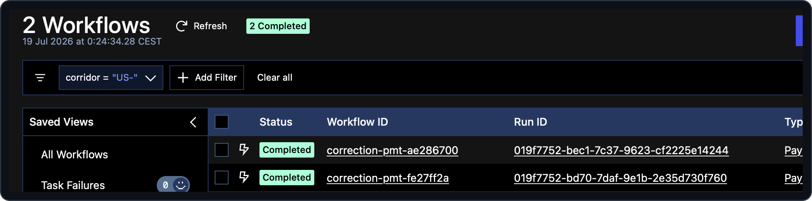

# 08 — Fleet-wide visibility with Search Attributes

> [!NOTE]
> **Goal of this step.** Tag every correction with its business
> dimensions — corridor, anomaly type, lifecycle status — so the whole
> fleet becomes filterable through Temporal's Visibility index, from the
> CLI and the Temporal Web UI. The app's own API and UI are left untouched;
> this is purely operator-facing visibility.

## At a glance

- **Feature:** `search-attributes`
- **Files touched:** [`payments/workflows.py`](../payments/workflows.py),
  [`payments/test_workflows.py`](../payments/test_workflows.py)
- **Temporal concepts:** Search Attributes, `upsert_search_attributes`, the
  Visibility API, list queries
- **Docs:** [Observability — Search Attributes](https://docs.temporal.io/develop/python/observability#search-attributes)
- **Builds on:** steps [02](02-durable-agents.md) and
  [03](03-human-approval-signal.md)

> [!IMPORTANT]
> **Start from a clean baseline.** Each page stands on its own. If you
> enabled features in other steps, reset first so nothing carries over:
>
> ```bash
> make feature-reset
> ```

## Why this matters

Once you run more than a handful of corrections, "show me everything on
the `US->IN` corridor" or "show me everything awaiting approval" becomes a
real operational need. Temporal answers it without any bespoke query
endpoint: **upsert Search Attributes** onto each workflow and its business
fields land in the Visibility index, queryable fleet-wide from the CLI and
the Temporal Web UI. This is one of the workshop's headline production
concerns —
operators get a searchable view of thousands of executions for free.

> **Scope.** This feature only *tags* the workflows. It deliberately does
> not change the payments API or the app — those keep reading each
> correction directly, so nothing on the app's screens depends on it.

## Step 1 — Preview the change

```bash
make feature-diff NAME=search-attributes
```

## Step 2 — Enable it

```bash
make feature-enable NAME=search-attributes
```

> [!NOTE]
> **No manual registration step.** The three custom attributes
> (`corridor`, `anomalyType`, `status`) are pre-registered by the dev
> server on startup (see the `temporal` service command in
> [`compose.yaml`](../compose.yaml)), so you do *not* run
> `temporal operator search-attribute create`.

> [!IMPORTANT]
> **Enable `human-approval-signal` too.** The `status` attribute reaches
> `awaiting-approval` only through the human-in-the-loop wait from step
> [03](03-human-approval-signal.md). With just `search-attributes` on, a
> correction never enters `awaiting-approval` — it runs straight from
> `processing` to a terminal `applied`/`held` — so the
> `status = 'awaiting-approval'` filter below would have nothing to match.
> Enable it as well:
>
> ```bash
> make feature-enable NAME=human-approval-signal
> ```

## Step 3 — Read the newly-live code

In [`payments/workflows.py`](../payments/workflows.py), the coordinator
now upserts typed Search Attributes at the top of `run`:

```python
workflow.upsert_search_attributes(
    [
        _CORRIDOR_SA.value_set(anomaly.corridor),
        _ANOMALY_TYPE_SA.value_set(str(anomaly.anomaly_type)),
        _STATUS_SA.value_set("processing"),
    ]
)
```

The typed keys are defined near the top of the file
(`SearchAttributeKey.for_keyword(...)`). The `status` attribute carries the
correction **lifecycle** (`processing` → `awaiting-approval`), driven by
the `_set_status(...)` helper — a no-op in the baseline that now actually
upserts.

> [!NOTE]
> The call is deterministic and workflow-safe, so it belongs in workflow
> code. `anomaly.anomaly_type` is a `StrEnum`, converted with `str(...)`
> because `value_set` expects a plain string for a keyword key.

## Step 4 — Run and observe

Start a few corrections (mix `memory-hit` and, if you have a key,
`compliance` from step [03](03-human-approval-signal.md) so some are
awaiting — on a memory miss; restart the stack to clear memory if it
auto-applies):

```bash
make simulator
make simulator SCENARIO=compliance   # needs an LLM provider API key
```

**From the CLI**, filter the fleet by any dimension:

```bash
temporal workflow list --namespace payments \
  --query "corridor = 'US->IN'"

temporal workflow list --namespace payments \
  --query "status = 'awaiting-approval'"

temporal workflow list --namespace payments \
  --query "anomalyType = 'currency_mismatch' AND status = 'awaiting-approval'"
```

**In the Temporal Web UI** (`/temporal`), the same queries work in the
executions search box:

```text
corridor = 'US->IN'
status = 'awaiting-approval'
```



Without Search Attributes you could only list *every* execution and sift
through them by hand; now Temporal's Visibility store answers the question
server-side, in one query.

## Step 5 — A note on replay

Like step [07](07-settlement-confirmation.md), adding the
`upsert_search_attributes` call changes the coordinator's Event History, so
it **invalidates the committed replay fixture** — `make test`'s replay
test failing after you enable this is expected, not a regression. To get it
green while the feature stays on, regenerate from a real run: `make
simulator`, grab the printed workflow id, then `make capture-history
WORKFLOW_ID=correction-pmt-XXXX` (the dev stack is already running, so no
separate memory service). See step [12](12-testing.md).

## Step 6 — Checkpoint

- [ ] Executions are filterable by `corridor` / `anomalyType` / `status`
      from the CLI and the Temporal Web UI.
- [ ] You can explain when to reach for Search Attributes (fleet-wide
      filtering) versus querying a single workflow directly.

## Revert

```bash
make feature-disable NAME=search-attributes
make feature-disable NAME=human-approval-signal
```

---

Next: [09 — Encrypting payloads](09-payload-encryption.md).
