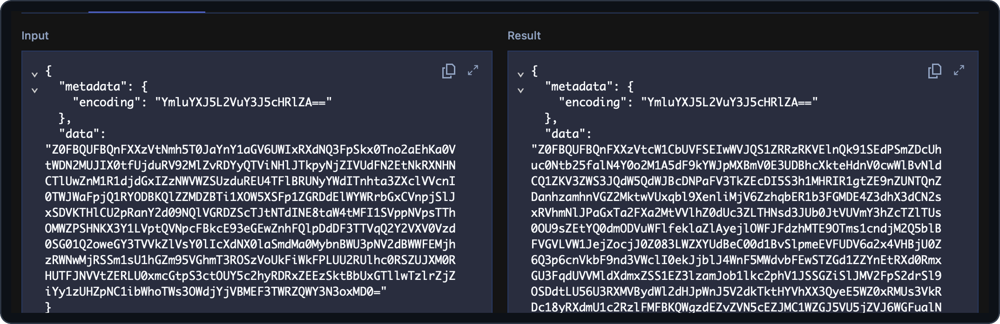
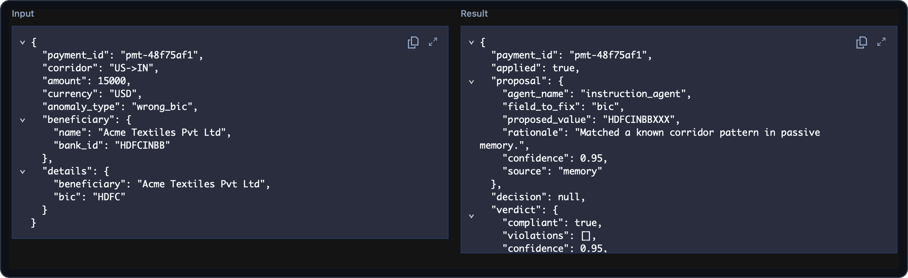

# 09 — Encrypting payloads (codec server)

> [!NOTE]
> **Goal of this step.** Encrypt every payload that crosses the Temporal
> boundary, so sensitive fields (bank identifiers, amounts) rest in Event
> History as ciphertext — then use a **codec server** to decrypt them on
> demand in the Temporal Web UI.

## At a glance

- **Feature:** `payload-encryption`
- **Files touched:** [`payments/main_worker.py`](../payments/main_worker.py),
  [`payments/api.py`](../payments/api.py) (uses
  [`shared/encryption.py`](../shared/encryption.py), [`codec/`](../codec/))
- **Temporal concepts:** `PayloadCodec`, data converters, the codec server,
  encryption at the boundary
- **Docs:** [Data encryption](https://docs.temporal.io/production-deployment/data-encryption)
- **Builds on:** step [02](02-durable-agents.md)

> [!IMPORTANT]
> **Start from a clean baseline.** Each page stands on its own. If you
> enabled features in other steps, reset first so nothing carries over:
>
> ```bash
> make feature-reset
> ```

## Why this matters

A cross-border payment carries data you do not want sitting in plaintext
in Event History — BICs, amounts, beneficiary details. A **`PayloadCodec`**
sits at the very edge of serialization: the SDK calls `encode` on the way
out and `decode` on the way in, so payloads travel and rest as ciphertext.
The trade-off: Temporal now shows ciphertext too — which is where the
**codec server** comes in. This is a headline production concern for the
workshop.

## Step 1 — Preview the change

```bash
make feature-diff NAME=payload-encryption
```

## Step 2 — Enable it

```bash
make feature-enable NAME=payload-encryption
```

> [!IMPORTANT]
> **What you must configure.** Payload encryption needs a Fernet key in
> `CODEC_ENCRYPTION_KEY`: the worker and the API **refuse to start**
> without it rather than run unencrypted. You do not have to generate one
> for the workshop — [`.env.example`](../.env.example) ships a working
> (public, **insecure**) dev default, so the `cp .env.example .env` from
> step [01](01-getting-started.md) already covers it. On the *decode* side
> the codec server falls back to that same key when unset, logging a
> warning, so the Temporal Web UI decodes out of the box. Set your own values in
> `.env` when you want to actually secure the setup.

## Step 3 — Read the code

**The codec itself** — [`shared/encryption.py`](../shared/encryption.py)
defines `EncryptionCodec`, a `PayloadCodec` that encrypts with **Fernet**
(AES-128-CBC + HMAC). Note two production-minded details in its `NOTE:`s:

- `encode` marks its output with an `encoding` metadata tag, and `decode`
  passes through anything *not* carrying that tag — so mixed
  plaintext/ciphertext histories decode gracefully.
- Fernet's crypto runs via `asyncio.to_thread` to keep the event loop
  responsive.

**Wiring it in** — the change touches *two* processes, the
worker ([`payments/main_worker.py`](../payments/main_worker.py)) and the
API ([`payments/api.py`](../payments/api.py)). Both swap their
`Client.connect(...)` for one that passes an encrypting data converter:

```python
key = load_key()
if not key:
    raise RuntimeError("set CODEC_ENCRYPTION_KEY to enable payload encryption")
client = await Client.connect(
    TEMPORAL_ADDRESS,
    namespace=PAYMENTS_TEMPORAL_NAMESPACE,
    data_converter=build_data_converter(EncryptionCodec(key)),
    plugins=[PydanticAIPlugin()],
)
```

Read the `NOTE:` — the `PydanticAIPlugin` stays alongside the explicit
`data_converter` on purpose: the plugin only installs its own converter
when you do not pass one, and dropping it breaks `TemporalAgent` sandbox
validation at worker start-up.

**The codec server** — [`codec/`](../codec/) is a small HTTP service that
reuses the same key to decrypt payloads on demand; Temporal and the CLI
call it to display cleartext. It comes up with the stack and needs no extra
configuration.

## Step 4 — Run and observe

Fire a correction:

```bash
make simulator
```

**Before wiring the UI to the codec:** open the coordinator in Temporal and
inspect Event History — payloads now show as raw ciphertext.



**Decoded:** the dev server is already pointed at the codec server, so
Temporal decrypts payloads for display automatically — the same Event
History now shows cleartext.



**From the CLI**, point `temporal` at the codec to read decrypted payloads:

```bash
temporal workflow show \
  --workflow-id correction-<payment_id> \
  --namespace payments \
  --codec-endpoint http://localhost:8080/codec
```

> [!CAUTION]
> **Run the `temporal` CLI from the host, never a container** — the
> `localhost` codec endpoint is reachable only from the host.

## Step 5 — The production caveat

The reference codec server requires a bearer token, but with the insecure
defaults it is effectively an **unauthenticated decryption oracle**: a
codec server must be authenticated (mTLS or a bearer token) and
TLS-terminated, or anyone who can reach it can decrypt any payload. Set
`CODEC_ENCRYPTION_KEY` and `CODEC_SERVER_AUTH_TOKEN` to real values to
close that gap.

## Step 6 — Checkpoint

- [ ] Event History shows ciphertext with the feature on.
- [ ] Temporal decodes payloads through the codec server.
- [ ] You can explain why the codec server must be authenticated in
      production.

## Revert

```bash
make feature-disable NAME=payload-encryption
```

---

Next: [10 — Durable state as an Entity Workflow](10-memory-workflow.md).
