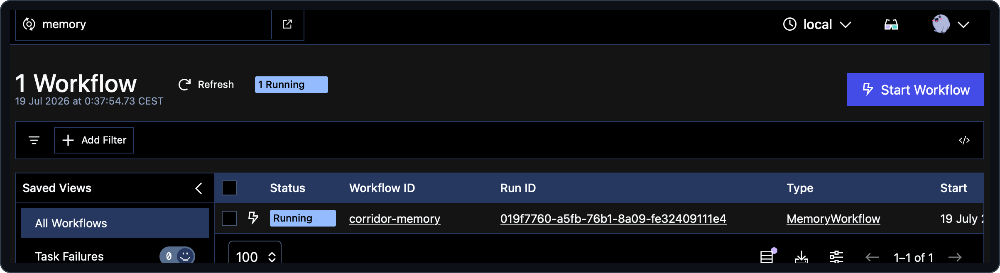
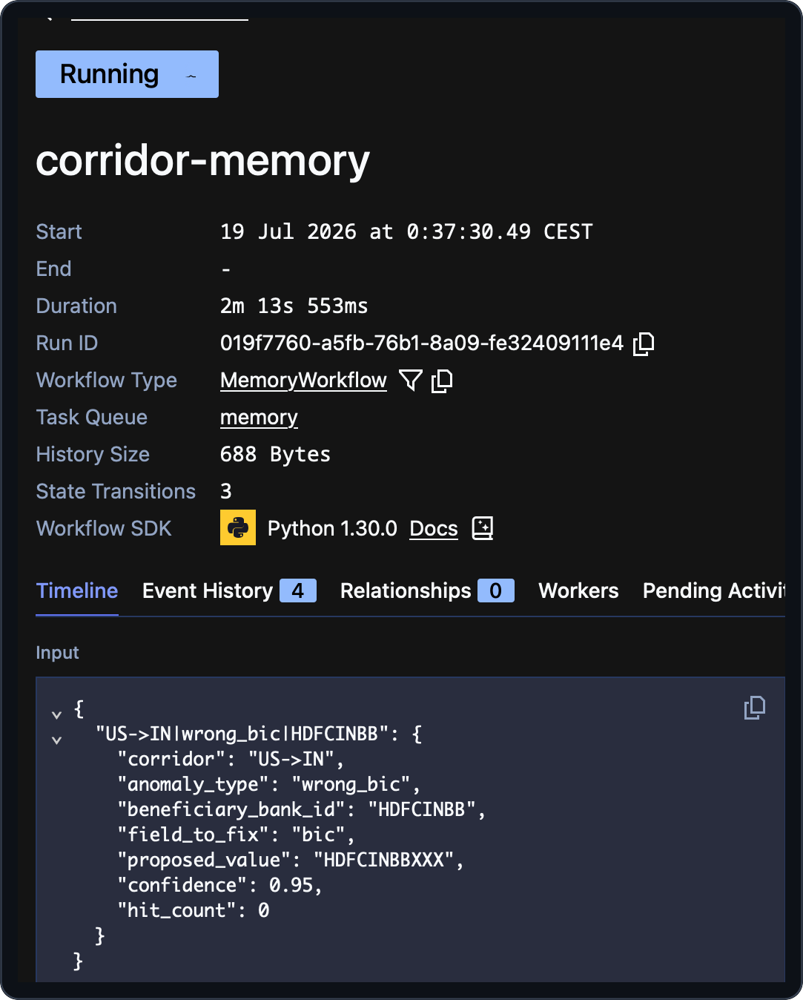

# 10 — Durable state as an Entity Workflow

> [!NOTE]
> **Goal of this step.** Swap the corridor memory's naive in-memory store
> for a **durable Temporal workflow** — the *Entity Workflow* pattern —
> served by a **query** for reads and an **update** for writes, and kept
> bounded with **continue-as-new**.

## At a glance

- **Feature:** `memory-workflow`
- **Files touched:** [`memory/app.py`](../memory/app.py) (activates
  [`memory/workflow.py`](../memory/workflow.py))
- **Temporal concepts:** Entity Workflow pattern, Query, Update (with
  validator), `@workflow.init`, continue-as-new, embedded worker
- **Docs:** [Message passing](https://docs.temporal.io/develop/python/message-passing)
  · [Send an Update](https://docs.temporal.io/develop/python/message-passing#send-update-from-client)
- **Builds on:** steps [00](00-application-overview.md) and
  [02](02-durable-agents.md)

> [!IMPORTANT]
> **Start from a clean baseline.** Each page stands on its own. If you
> enabled features in other steps, reset first so nothing carries over:
>
> ```bash
> make feature-reset
> ```

## Why this matters

In the baseline the corridor memory is a plain in-process dictionary
([`memory/store.py`](../memory/store.py)) — fine for a demo, but it loses
everything on restart and keeps no audit trail. The **Entity Workflow**
pattern turns that state into a single long-lived workflow instance: state
lives *in the workflow* (no disk, no database), reads are Temporal
**queries** (never recorded in history), and writes are Temporal
**updates** (synchronous, validated, durably acknowledged). This also
shows off a service hosting its *own* embedded worker in its *own*
namespace.

## Step 1 — Preview the change

```bash
make feature-diff NAME=memory-workflow
```

## Step 2 — Enable it

```bash
make feature-enable NAME=memory-workflow
```

## Step 3 — Read the newly-live code

**The entity workflow** — [`memory/workflow.py`](../memory/workflow.py) is
dormant in the baseline (imported only from the `FEATURE-ON` blocks) and
comes alive now. `MemoryWorkflow` is a singleton with a well-known id
(`corridor-memory`). Study its four members:

- **`@workflow.init`** seeds state *before* any handler runs:

  > Seeding happens in the initializer, not in `run`. With `@workflow.init`,
  > `__init__` receives the same arguments as `run` and completes before any
  > update/signal handler executes — so an early `remember` delivered in the
  > very first workflow task cannot be lost by a later seeding assignment.
  > Docs: [Workflow initializer](https://docs.temporal.io/develop/python/message-passing#workflow-initializer).

- **`@workflow.query lookup(...)`** — read-only, never recorded in history,
  so lookups add no audit events.
- **`@workflow.update remember(...)`** with a **`@remember.validator`** —
  the validator runs *before* the update is admitted to history, so an
  invalid write is never durably recorded. This is the acknowledged-write
  advantage of **Update over Signal**.
- **`run`** waits until `MAX_UPDATES_BEFORE_CONTINUE`, drains in-flight
  handlers (`workflow.all_handlers_finished`), then `continue_as_new` —
  keeping history bounded while carrying state forward.

**Swapping the backend** — in [`memory/app.py`](../memory/app.py), the two
HTTP handlers swap their backend calls:

```python
# lookup: baseline -> store.lookup(...); enabled -> a Temporal query
pattern = await handle.query(
    MemoryWorkflow.lookup, args=[corridor, anomaly_type, beneficiary_bank_id]
)

# remember: baseline -> store.remember(...); enabled -> a Temporal update
await handle.execute_update(MemoryWorkflow.remember, pattern)
```

> [!NOTE]
> **Update, not Signal, for the write.** `execute_update` returns only
> after the write is validated and durably accepted, so the HTTP `204` is a
> genuine acknowledgement — the caller knows the pattern is recorded.

Also read the `memory-workflow` lifespan block: the service now hosts an
**embedded Temporal worker** (in a FastAPI lifespan) on the `memory`
namespace, and ensures the singleton is running and seeded with
`WorkflowIDConflictPolicy.USE_EXISTING` — making startup idempotent across
reloads. Note the `HTTP contract is unchanged`: `/api/memory/v1` looks
identical to callers; only the backend behind it changed. That is the
payoff of the interface boundary from step [02](02-durable-agents.md).

## Step 4 — Run and observe

Restart the memory service so the lifespan wires up the worker (hot reload
under `make dev` handles this). Then, in the Temporal Web UI, switch to the
**`memory` namespace** and find the `corridor-memory` workflow — it is
Running, holding the seeded patterns:



Open it: its input carries the seeded corridor patterns the entity workflow
holds as durable, in-workflow state — no database behind it.



Now exercise it end to end. Run an agent scenario that misses memory so the
agents reason out a fix:

```bash
make simulator SCENARIO=memory-miss   # needs an LLM provider API key
```

`memory-miss` settles USD into a `US->GB` corridor, so the compliance agent
flags a currency mismatch (GB expects GBP) and the fail-closed gate *holds*
the correction — it is not applied, so no write-back happens on its own. The
Update lands only once a fix is actually *applied*: enable
`human-approval-signal` (step [03](03-human-approval-signal.md)) and approve
the held correction. When it applies, an **Update** lands on
`corridor-memory` (the write-back) in the `memory` namespace and its state
grows; re-run the *same* corridor and it now resolves from memory via a
**Query** — no model call, no new history event for the read.

## Step 5 — Checkpoint

- [ ] `corridor-memory` runs as a singleton workflow in the `memory`
      namespace.
- [ ] A learned pattern arrives as an **Update**; a lookup is a **Query**.
- [ ] You can explain why the write uses Update (validated, acknowledged)
      rather than Signal, and why the HTTP contract did not change.

## Revert

```bash
make feature-disable NAME=memory-workflow
```

---

Next: [11 — Observability](11-observability.md).
